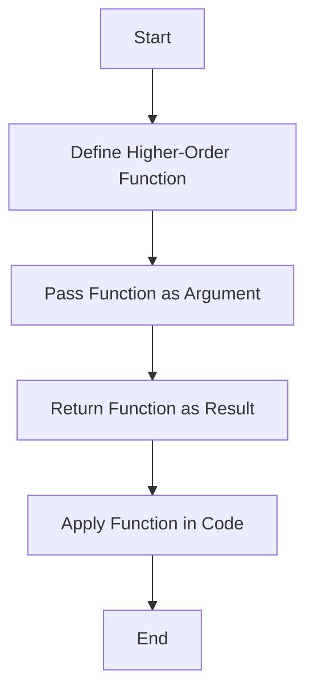

## 4.4. Practical Exercises

Higher-order functions are a cornerstone of functional programming, enabling developers to write more abstract, flexible, and reusable code. In this section, we will delve into practical exercises that will help you understand and apply higher-order functions in real-world scenarios. These exercises will not only solidify your understanding but also demonstrate the practical utility of higher-order functions in functional programming projects.

### Writing and Using Higher-Order Functions in Projects

Higher-order functions are functions that can take other functions as arguments or return them as results. They are incredibly powerful for creating flexible and reusable code components. Let's explore some exercises to implement higher-order functions within small projects.

#### Exercise 1: Scala - Applying a Function Twice

In this exercise, you will implement a higher-order function in Scala that applies a given function twice to an input value. This is a simple yet effective way to understand the concept of function composition and higher-order functions.

```scala
// Task: Implement a higher-order function that applies a function twice
def applyTwice[A](f: A => A, x: A): A = f(f(x))

def increment(x: Int): Int = x + 1

println(applyTwice(increment, 5)) // Output: 7
```

**Explanation:**
- `applyTwice` is a higher-order function that takes a function `f` and an argument `x`. It applies `f` to `x` twice.
- The `increment` function is a simple function that adds one to its input.
- By calling `applyTwice(increment, 5)`, the `increment` function is applied twice to the number 5, resulting in 7.

#### Exercise 2: JavaScript - Creating a Multiplier Function

In this JavaScript exercise, you will create a higher-order function that returns another function to multiply a number by a given factor. This demonstrates how higher-order functions can be used to create customizable and reusable code components.

```javascript
// Task: Create a higher-order function that returns a function to multiply by a given factor
const makeMultiplier = (factor) => (x) => x * factor;

const triple = makeMultiplier(3);
console.log(triple(4)); // Output: 12
```

**Explanation:**
- `makeMultiplier` is a higher-order function that takes a `factor` and returns a new function.
- The returned function takes a number `x` and multiplies it by the `factor`.
- By calling `makeMultiplier(3)`, you create a new function `triple` that triples its input. Calling `triple(4)` results in 12.

### Analyzing Code to Identify Higher-Order Functions

Understanding how to identify higher-order functions in code is crucial for mastering functional programming. Let's analyze some code samples to identify and explain the higher-order functions used.

#### Code Sample Analysis

Consider the following code snippet:

```scala
val numbers = List(1, 2, 3, 4, 5)
val doubledNumbers = numbers.map(_ * 2)
println(doubledNumbers) // Output: List(2, 4, 6, 8, 10)
```

**Analysis:**
- The `map` function is a higher-order function. It takes a function (`_ * 2`) as an argument and applies it to each element of the `numbers` list.
- The result is a new list `doubledNumbers` where each element is doubled.

### Utilizing Closures in Functional Code

Closures are functions that capture the lexical scope in which they were defined. They are useful for maintaining state or encapsulating behavior. Let's create functions that leverage closures.

#### Exercise: JavaScript - Counter with Closures

Create a counter function that uses closures to maintain state.

```javascript
// Task: Create a counter function using closures
const createCounter = () => {
  let count = 0;
  return () => {
    count += 1;
    return count;
  };
};

const counter = createCounter();
console.log(counter()); // Output: 1
console.log(counter()); // Output: 2
```

**Explanation:**
- `createCounter` returns a function that increments and returns the `count` variable.
- The `count` variable is maintained in the closure, allowing the returned function to access and modify it.

### Visual Aids

To better understand the integration and flow of higher-order functions within codebases, let's use a Mermaid.js diagram to illustrate these concepts.



**Explanation:**
- This diagram illustrates the typical flow of using higher-order functions: defining them, passing functions as arguments, returning functions as results, and applying them in code.

### Summary of Key Points

- Higher-order functions are essential for creating flexible and reusable code.
- They can take functions as arguments or return them as results.
- Practical exercises in Scala and JavaScript demonstrate their utility.
- Closures allow functions to maintain state and encapsulate behavior.
- Visual aids like diagrams can help conceptualize the flow of higher-order functions in codebases.

### References and Further Reading

- "Real World Haskell" by Bryan O'Sullivan, John Goerzen, and Don Stewart.
- "Functional Programming in Scala" by Paul Chiusano and Rúnar Bjarnason.

## Quiz Time!



### What is a higher-order function?

- [x] A function that takes other functions as arguments or returns them as results
- [ ] A function that only performs arithmetic operations
- [ ] A function that is defined inside another function
- [ ] A function that does not return any value

> **Explanation:** Higher-order functions can take other functions as arguments or return them as results, enabling more abstract and flexible code.

### In the Scala example, what does the `applyTwice` function do?

- [x] It applies a given function twice to an input value
- [ ] It applies a given function once to an input value
- [ ] It doubles the input value
- [ ] It increments the input value by two

> **Explanation:** The `applyTwice` function applies the given function `f` to the input `x` twice.

### What is the purpose of the `makeMultiplier` function in JavaScript?

- [x] To create a function that multiplies a number by a given factor
- [ ] To add a number to a given factor
- [ ] To divide a number by a given factor
- [ ] To subtract a number from a given factor

> **Explanation:** The `makeMultiplier` function returns a new function that multiplies its input by the specified factor.

### How do closures help in functional programming?

- [x] They allow functions to capture and maintain state
- [ ] They make functions run faster
- [ ] They prevent functions from being called
- [ ] They make functions immutable

> **Explanation:** Closures capture the lexical scope in which they were defined, allowing functions to maintain state across calls.

### In the counter example, what role does the closure play?

- [x] It maintains the `count` variable state across function calls
- [ ] It resets the `count` variable to zero
- [ ] It prevents the function from being called
- [ ] It makes the function immutable

> **Explanation:** The closure captures the `count` variable, allowing the returned function to access and modify it across calls.

### What is a common use case for higher-order functions?

- [x] Creating reusable and flexible code components
- [ ] Performing only arithmetic operations
- [ ] Writing code that does not return any value
- [ ] Defining variables inside functions

> **Explanation:** Higher-order functions are used to create reusable and flexible code components by abstracting behavior.

### Which of the following is NOT a characteristic of higher-order functions?

- [ ] They can take functions as arguments
- [ ] They can return functions as results
- [x] They can only perform arithmetic operations
- [ ] They enable function composition

> **Explanation:** Higher-order functions are not limited to arithmetic operations; they can take and return functions, enabling composition.

### What does the `map` function do in Scala?

- [x] It applies a given function to each element of a list
- [ ] It sorts the elements of a list
- [ ] It filters elements of a list based on a condition
- [ ] It reduces a list to a single value

> **Explanation:** The `map` function applies a given function to each element of a list, returning a new list with the results.

### How can higher-order functions improve code readability?

- [x] By abstracting complex logic into reusable components
- [ ] By making code longer and more complex
- [ ] By removing all comments from the code
- [ ] By using only global variables

> **Explanation:** Higher-order functions abstract complex logic into reusable components, improving code readability and maintainability.

### True or False: Closures can only be used in JavaScript.

- [ ] True
- [x] False

> **Explanation:** Closures are a concept in many programming languages, not just JavaScript. They allow functions to capture and maintain state.


