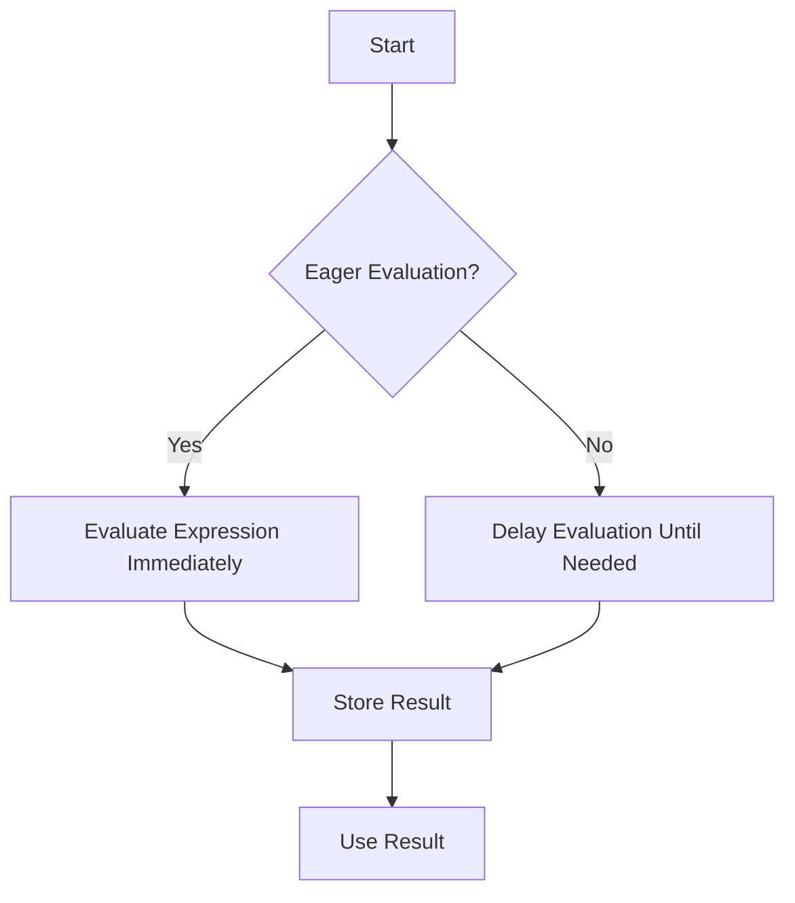

## 5.1. Introduction to Lazy Evaluation

Lazy evaluation is a powerful concept in functional programming that can significantly enhance the efficiency and expressiveness of your code. In this section, we will delve into what lazy evaluation is, how it contrasts with eager evaluation, and why it is beneficial. We'll also explore practical examples in Haskell, Scala, and JavaScript to illustrate how lazy evaluation can be implemented across different programming languages.

### Understanding Lazy vs. Eager Evaluation

Lazy evaluation is a strategy where expressions are not evaluated until their values are actually needed. This contrasts with eager evaluation, where expressions are evaluated as soon as they are bound to a variable. Let's break down these concepts further:

- **Eager Evaluation:** Also known as strict evaluation, this approach computes the value of an expression as soon as it is assigned. This can lead to unnecessary computations, especially if the result is never used.

- **Lazy Evaluation:** This approach delays the computation of an expression until its value is required. This can lead to performance improvements by avoiding unnecessary calculations and can also allow for the creation of infinite data structures.

#### Visualizing the Difference

To better understand the difference between lazy and eager evaluation, consider the following diagram:



### Benefits and Use Cases

Lazy evaluation offers several advantages, making it a valuable tool in functional programming:

1. **Improved Performance:** By deferring computations until necessary, lazy evaluation can reduce the number of calculations performed, leading to faster execution times in some cases.

2. **Memory Efficiency:** Lazy evaluation can help manage memory usage more effectively by only storing values that are actually needed.

3. **Infinite Data Structures:** One of the most compelling use cases for lazy evaluation is the ability to work with infinite data structures. Since values are only computed as needed, you can define structures that conceptually have no end, like an infinite list of numbers.

4. **Enhanced Modularity:** Lazy evaluation allows for more modular code, as functions can be composed without worrying about the order of evaluation.

### Code Snippets

Let's look at how lazy evaluation is implemented in different functional programming languages:

#### Haskell (Lazy Evaluation by Default)

Haskell is a language that employs lazy evaluation by default. This allows for elegant handling of infinite data structures:

```haskell
infiniteList = [1..]
take 5 infiniteList -- [1,2,3,4,5]
```

In this example, `infiniteList` is an infinite list of numbers starting from 1. The `take` function retrieves the first 5 elements, demonstrating how Haskell handles infinite lists seamlessly.

#### Scala (Lazy Collections)

Scala provides lazy collections, such as `Stream`, which allow for lazy evaluation:

```scala
val infiniteStream = Stream.from(1)
infiniteStream.take(5).toList // List(1, 2, 3, 4, 5)
```

Here, `Stream.from(1)` creates an infinite stream of numbers starting from 1. The `take` method is used to extract the first 5 elements, showcasing Scala's capability to handle lazy evaluation.

#### JavaScript (Using Generators for Laziness)

JavaScript, while not a purely functional language, can achieve lazy evaluation using generators:

```javascript
function* infiniteNumbers() {
  let n = 1;
  while (true) {
    yield n++;
  }
}

const gen = infiniteNumbers();
console.log(gen.next().value); // 1
console.log(gen.next().value); // 2
console.log(gen.next().value); // 3
```

In this example, the generator function `infiniteNumbers` yields an infinite sequence of numbers. The `next` method is used to retrieve values one at a time, illustrating lazy evaluation in JavaScript.

### References

For further reading and a deeper understanding of lazy evaluation and its applications, consider the following resources:

- "Programming in Haskell" by Graham Hutton.
- "Purely Functional Data Structures" by Chris Okasaki.

These texts provide comprehensive insights into functional programming concepts and data structures, including lazy evaluation.

### Conclusion

Lazy evaluation is a cornerstone of functional programming, offering numerous benefits such as performance optimization, memory efficiency, and the ability to work with infinite data structures. By understanding and leveraging lazy evaluation, you can write more efficient and expressive functional code. In the next sections, we will explore how lazy evaluation can be applied to infinite data structures and delve deeper into its practical applications.

## Quiz Time!



### What is lazy evaluation?

- [x] A strategy where expressions are evaluated only when needed.
- [ ] A strategy where expressions are evaluated immediately.
- [ ] A method to optimize eager evaluation.
- [ ] A technique to avoid evaluating expressions altogether.

> **Explanation:** Lazy evaluation defers the computation of expressions until their values are required, unlike eager evaluation which computes immediately.

### Which language uses lazy evaluation by default?

- [x] Haskell
- [ ] Scala
- [ ] JavaScript
- [ ] Python

> **Explanation:** Haskell is known for using lazy evaluation by default, allowing it to handle infinite data structures naturally.

### What is a benefit of lazy evaluation?

- [x] Improved performance by avoiding unnecessary computations.
- [ ] Increased memory usage.
- [ ] Immediate computation of all expressions.
- [ ] Reduced code readability.

> **Explanation:** Lazy evaluation can improve performance by computing values only when they are needed, thus avoiding unnecessary calculations.

### How does Scala implement lazy evaluation?

- [ ] Using default lazy evaluation for all expressions.
- [x] Through lazy collections like `Stream`.
- [ ] By using generators.
- [ ] By default in all data types.

> **Explanation:** Scala uses lazy collections such as `Stream` to implement lazy evaluation, allowing for deferred computation.

### What is an infinite data structure?

- [x] A data structure that can conceptually have no end.
- [ ] A data structure with a fixed size.
- [ ] A data structure that cannot be traversed.
- [ ] A data structure that is always fully computed.

> **Explanation:** An infinite data structure is one that can be defined without a fixed end, often used in conjunction with lazy evaluation.

### How can JavaScript achieve lazy evaluation?

- [ ] By default in all functions.
- [ ] Using lazy collections.
- [x] Using generators.
- [ ] Through strict evaluation.

> **Explanation:** JavaScript can achieve lazy evaluation using generators, which allow values to be produced on demand.

### What does the `take` function do in Haskell?

- [x] Retrieves a specified number of elements from a list.
- [ ] Evaluates all elements of a list.
- [ ] Removes elements from a list.
- [ ] Sorts a list.

> **Explanation:** The `take` function in Haskell retrieves a specified number of elements from a list, useful in lazy evaluation contexts.

### Which of the following is NOT a benefit of lazy evaluation?

- [ ] Improved performance.
- [ ] Memory efficiency.
- [x] Immediate computation of all expressions.
- [ ] Ability to work with infinite data structures.

> **Explanation:** Immediate computation of all expressions is characteristic of eager evaluation, not lazy evaluation.

### What is eager evaluation?

- [ ] A strategy where expressions are evaluated only when needed.
- [x] A strategy where expressions are evaluated immediately.
- [ ] A method to optimize lazy evaluation.
- [ ] A technique to avoid evaluating expressions altogether.

> **Explanation:** Eager evaluation computes expressions as soon as they are bound to a variable, unlike lazy evaluation.

### True or False: Lazy evaluation can help manage memory usage more effectively.

- [x] True
- [ ] False

> **Explanation:** Lazy evaluation can help manage memory usage by only storing values that are actually needed, thus being more efficient.


