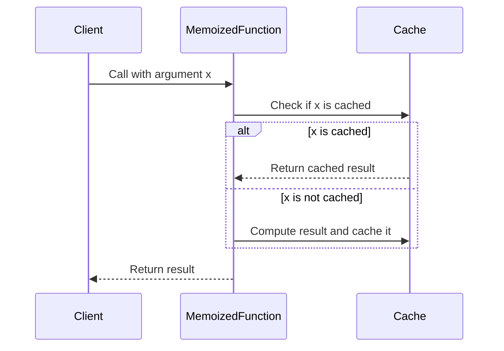

## 5.2. Implementing Lazy Evaluation

Lazy evaluation is a powerful concept in functional programming that allows computations to be deferred until their results are actually needed. This approach can lead to significant performance improvements, especially when dealing with potentially infinite data structures or expensive computations. In this section, we will explore how lazy evaluation is implemented in functional languages like Haskell and Scala, and delve into the concepts of memoization and thunks.

### Techniques in Functional Languages

Lazy evaluation is a core feature in some functional languages, most notably Haskell, where it is the default evaluation strategy. In contrast, languages like Scala provide mechanisms to enable lazy evaluation explicitly. Let's explore how these languages implement lazy evaluation and the benefits it offers.

#### Haskell: Lazy by Default

Haskell is a purely functional language that employs lazy evaluation as its default strategy. This means that expressions are not evaluated until their values are required. This approach allows Haskell to handle infinite data structures seamlessly and optimize performance by avoiding unnecessary computations.

For example, consider the following Haskell code:

```haskell
let x = 10
let y = x + 5 -- y is a thunk
```

In this snippet, `y` is not immediately computed. Instead, it is represented as a "thunk," a deferred computation that will only be evaluated when `y` is actually used. This lazy behavior allows Haskell to efficiently manage resources and optimize execution.

#### Scala: Explicit Laziness

Scala, while not lazy by default, provides constructs to enable lazy evaluation. The `lazy` keyword in Scala can be used to defer the evaluation of an expression until it is accessed for the first time. This is particularly useful for optimizing performance in scenarios where certain computations may not be needed.

Here's an example in Scala:

```scala
lazy val x = {
  println("Computing x")
  10 + 5
}

println("Before accessing x")
println(x) // The computation happens here
println(x) // The cached result is used here
```

In this example, the expression assigned to `x` is not computed until `x` is accessed. The first access triggers the computation, and subsequent accesses use the cached result, demonstrating both laziness and memoization.

### Memoization and Thunks

Memoization is a technique used to cache the results of expensive function calls, ensuring that they are not recomputed unnecessarily. This can be particularly beneficial in recursive functions or when dealing with large datasets.

#### Memoization in JavaScript

JavaScript, while not a purely functional language, can implement memoization to optimize performance. Here's a simple example of a memoization function in JavaScript:

```javascript
const memoize = (f) => {
  const cache = {};
  return (x) => {
    if (cache[x]) return cache[x];
    const result = f(x);
    cache[x] = result;
    return result;
  };
};

const expensiveFunction = (x) => {
  // Simulate expensive computation
  for(let i=0; i<1e6; i++) {}
  return x * x;
};

const memoizedExpensiveFunction = memoize(expensiveFunction);
```

In this code, `memoize` is a higher-order function that takes a function `f` and returns a new function that caches the results of `f`. The `expensiveFunction` simulates a costly computation, and `memoizedExpensiveFunction` ensures that each input is only computed once.

#### Thunks: Deferred Computations

Thunks are a fundamental concept in lazy evaluation, representing deferred computations. In languages like Haskell, thunks are used to delay evaluation until a value is needed. This allows for efficient handling of infinite data structures and optimization of resource usage.

### Visual Aids

To better understand memoization and thunks, let's visualize these concepts using a Mermaid.js sequence diagram.



This diagram illustrates the process of memoization, where a function checks if a result is cached before computing it. If the result is cached, it is returned immediately; otherwise, the function computes the result and caches it for future use.

### Practical Exercises

To reinforce your understanding of lazy evaluation, try implementing the following exercises:

1. **Haskell Thunks:** Write a Haskell program that demonstrates the use of thunks by creating an infinite list and accessing its elements lazily.

2. **Scala Lazy Evaluation:** Implement a Scala program using the `lazy` keyword to defer the computation of a complex expression. Measure the performance difference with and without laziness.

3. **JavaScript Memoization:** Extend the JavaScript memoization example to handle multiple arguments and test it with a recursive function like Fibonacci.

### Conclusion

Lazy evaluation is a powerful technique in functional programming that allows for deferred computation and efficient resource management. By understanding how languages like Haskell and Scala implement lazy evaluation, and by utilizing techniques like memoization and thunks, developers can optimize their programs for performance and scalability.

### References

- "Purely Functional Data Structures" by Chris Okasaki.
- "Scala for the Impatient" by Cay S. Horstmann.

## Quiz Time!



### What is lazy evaluation?

- [x] A strategy that delays computation until the result is needed
- [ ] A method to evaluate all expressions eagerly
- [ ] A technique to execute functions in parallel
- [ ] A way to cache function results

> **Explanation:** Lazy evaluation defers computation until the result is required, optimizing performance and resource usage.

### Which language uses lazy evaluation by default?

- [x] Haskell
- [ ] Scala
- [ ] JavaScript
- [ ] Python

> **Explanation:** Haskell employs lazy evaluation as its default strategy, allowing for efficient handling of infinite data structures.

### What is a thunk in the context of lazy evaluation?

- [x] A deferred computation
- [ ] A type of cache
- [ ] A parallel execution unit
- [ ] A mutable variable

> **Explanation:** A thunk represents a deferred computation that is evaluated only when its value is needed.

### How does Scala enable lazy evaluation?

- [x] Using the `lazy` keyword
- [ ] By default, all expressions are lazy
- [ ] Through a special library
- [ ] By using mutable variables

> **Explanation:** Scala uses the `lazy` keyword to defer the evaluation of expressions until they are accessed.

### What is memoization?

- [x] Caching the results of expensive function calls
- [ ] A method to execute functions in parallel
- [ ] A way to defer computations
- [ ] A technique to optimize recursion

> **Explanation:** Memoization caches the results of expensive function calls to avoid redundant computations.

### In JavaScript, what does the `memoize` function do?

- [x] Caches function results to optimize performance
- [ ] Executes functions in parallel
- [ ] Defers computation until needed
- [ ] Converts functions to thunks

> **Explanation:** The `memoize` function in JavaScript caches results of function calls to improve performance.

### What is the benefit of using lazy evaluation?

- [x] Avoiding unnecessary computations
- [ ] Increasing memory usage
- [ ] Executing functions in parallel
- [ ] Making code mutable

> **Explanation:** Lazy evaluation avoids unnecessary computations, optimizing performance and resource usage.

### Which of the following is a benefit of memoization?

- [x] Reducing redundant computations
- [ ] Increasing code complexity
- [ ] Making code mutable
- [ ] Executing functions in parallel

> **Explanation:** Memoization reduces redundant computations by caching results, improving efficiency.

### What is the purpose of the `lazy` keyword in Scala?

- [x] To defer computation until the value is accessed
- [ ] To execute functions in parallel
- [ ] To cache function results
- [ ] To make variables mutable

> **Explanation:** The `lazy` keyword in Scala defers computation until the value is accessed, enabling lazy evaluation.

### True or False: In Haskell, all expressions are evaluated eagerly by default.

- [ ] True
- [x] False

> **Explanation:** In Haskell, expressions are evaluated lazily by default, meaning they are computed only when needed.


