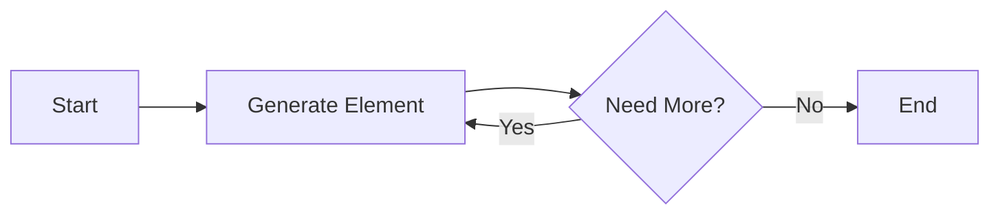

## 5.3. Working with Infinite Data Structures

In the realm of functional programming, infinite data structures such as streams and lazy lists play a pivotal role in handling potentially unbounded sequences of data. These structures allow us to define sequences that are computed on-demand, enabling efficient memory usage and the ability to work with large or even infinite datasets. This section delves into the concepts of streams and lazy lists, demonstrating how to generate and consume infinite sequences using lazy evaluation.

### Streams and Lazy Lists

Streams and lazy lists are fundamental constructs in functional programming that enable the representation of infinite sequences. Unlike traditional lists, which are fully realized in memory, streams and lazy lists generate their elements only when needed. This lazy evaluation strategy allows for efficient computation and memory management, especially when dealing with large datasets or sequences that are conceptually infinite.

#### Definition and Characteristics

- **Streams:** A stream is a sequence of data elements made available over time. In functional programming, streams are often implemented as lazy lists, where each element is computed only when required.
- **Lazy Lists:** A lazy list is a list where the computation of its elements is deferred until they are accessed. This allows for potentially infinite lists, as elements are only generated when needed.

### Generating and Consuming Infinite Sequences

The power of streams and lazy lists lies in their ability to represent infinite sequences. However, working with infinite sequences requires careful handling to ensure that only the necessary portion of the sequence is computed and consumed.

#### Creating Infinite Sequences

Infinite sequences can be generated using recursive definitions or generator functions. The key is to define a base case and a rule for generating subsequent elements.

**Haskell Example:**

In Haskell, infinite sequences are elegantly handled using lazy evaluation. Consider the example of generating prime numbers using the Sieve of Eratosthenes:

```haskell
primes = sieve [2..]

sieve (p:xs) = p : sieve [x | x <- xs, x `mod` p /= 0]

firstTenPrimes = take 10 primes
```

In this example, `primes` is an infinite list of prime numbers, and `firstTenPrimes` extracts the first ten primes by consuming only the necessary portion of the sequence.

**Scala Example:**

Scala's `Stream` provides a similar mechanism for lazy evaluation:

```scala
lazy val primes: Stream[Int] = {
  def sieve(s: Stream[Int]): Stream[Int] = s.head #:: sieve(s.tail filter (_ % s.head != 0))
  sieve(Stream.from(2))
}

primes.take(10).toList // List(2, 3, 5, 7, 11, 13, 17, 19, 23, 29)
```

Here, `primes` is a lazy stream of prime numbers, and `take(10)` retrieves the first ten elements.

**JavaScript Example (Using Generators):**

In JavaScript, generators can be used to create infinite sequences:

```javascript
function* primes() {
  yield 2;
  let current = 3;
  while (true) {
    if ([...primes()].every(p => current % p !== 0)) {
      yield current;
    }
    current += 2;
  }
}

const primeGen = primes();
const firstTenPrimes = Array.from({ length: 10 }, () => primeGen.next().value);
console.log(firstTenPrimes); // [2, 3, 5, 7, 11, 13, 17, 19, 23, 29]
```

The generator function `primes` yields prime numbers indefinitely, and `Array.from` is used to consume the first ten primes.

### Visualizing Infinite Data Streams

To better understand the flow and consumption of infinite data streams, consider the following diagram illustrating the structure of a stream and how elements are consumed:



This diagram represents the process of generating and consuming elements from a stream. Elements are generated on-demand, and the process continues until no more elements are needed.

### Best Practices and Considerations

- **Avoiding Infinite Loops:** When working with infinite sequences, ensure that your consuming functions are designed to terminate after processing the required number of elements.
- **Memory Management:** Take advantage of lazy evaluation to manage memory efficiently, especially when dealing with large datasets.
- **Performance Optimization:** Use lazy evaluation to defer computations and improve performance by avoiding unnecessary calculations.

### Real-World Applications

Infinite data structures are particularly useful in scenarios where data is continuously generated or when working with large datasets that cannot be fully loaded into memory. Examples include:

- **Data Streams:** Processing real-time data streams, such as sensor data or financial market feeds.
- **Algorithmic Trading:** Generating and evaluating trading signals based on continuous data inputs.
- **Simulation and Modeling:** Running simulations that require iterative computations over potentially infinite datasets.

### Conclusion

Infinite data structures, such as streams and lazy lists, are powerful tools in functional programming that enable efficient handling of large or unbounded sequences. By leveraging lazy evaluation, developers can create and consume infinite sequences with ease, optimizing both performance and memory usage. Understanding these concepts is crucial for building robust and scalable functional applications.

### Further Reading

For those interested in exploring these concepts further, consider the following resources:

- "Functional Programming in Scala" by Paul Chiusano and Rúnar Bjarnason.
- "Programming in Haskell" by Graham Hutton.

## Quiz Time!



### What is a stream in functional programming?

- [x] A sequence of data elements made available over time
- [ ] A fully realized list in memory
- [ ] A data structure that cannot be infinite
- [ ] A type of database

> **Explanation:** A stream is a sequence of data elements that are generated on-demand, allowing for potentially infinite sequences.

### How does lazy evaluation benefit infinite data structures?

- [x] It generates elements only when needed
- [ ] It precomputes all elements in advance
- [ ] It stores all elements in memory
- [ ] It limits the sequence to a finite number

> **Explanation:** Lazy evaluation generates elements only when they are needed, which is crucial for handling infinite sequences efficiently.

### Which language feature in JavaScript is used to create infinite sequences?

- [x] Generators
- [ ] Promises
- [ ] Callbacks
- [ ] Async/Await

> **Explanation:** Generators in JavaScript allow for the creation of sequences that can yield values on-demand, making them suitable for infinite sequences.

### What is the purpose of the `take` function in Haskell and Scala examples?

- [x] To consume a finite portion of an infinite sequence
- [ ] To generate an infinite sequence
- [ ] To transform a sequence into a list
- [ ] To filter elements from a sequence

> **Explanation:** The `take` function is used to consume a specified number of elements from an infinite sequence, allowing for safe consumption.

### What is a key characteristic of lazy lists?

- [x] Elements are computed only when accessed
- [ ] All elements are computed at once
- [ ] They cannot be infinite
- [ ] They are stored in a database

> **Explanation:** Lazy lists compute their elements only when accessed, enabling efficient handling of infinite sequences.

### How can infinite loops be avoided when working with infinite sequences?

- [x] Design consuming functions to terminate after processing required elements
- [ ] Use eager evaluation
- [ ] Store all elements in memory
- [ ] Avoid using streams

> **Explanation:** Consuming functions should be designed to terminate after processing the required number of elements to avoid infinite loops.

### What is a common use case for infinite data structures?

- [x] Processing real-time data streams
- [ ] Storing static data
- [ ] Precomputing all possible outcomes
- [ ] Limiting data to a fixed size

> **Explanation:** Infinite data structures are ideal for processing real-time data streams where data is continuously generated.

### Which of the following is NOT a benefit of lazy evaluation?

- [ ] Efficient memory usage
- [ ] Deferred computation
- [x] Immediate computation of all elements
- [ ] Improved performance

> **Explanation:** Lazy evaluation defers computation until necessary, which is the opposite of immediate computation of all elements.

### What is the role of the `sieve` function in the Haskell and Scala examples?

- [x] To filter out non-prime numbers
- [ ] To generate random numbers
- [ ] To sort a list
- [ ] To compute factorials

> **Explanation:** The `sieve` function filters out non-prime numbers, generating a sequence of prime numbers.

### True or False: Streams and lazy lists can only be used in functional programming languages.

- [ ] True
- [x] False

> **Explanation:** While streams and lazy lists are common in functional programming, they can be implemented in other paradigms using appropriate language features.


