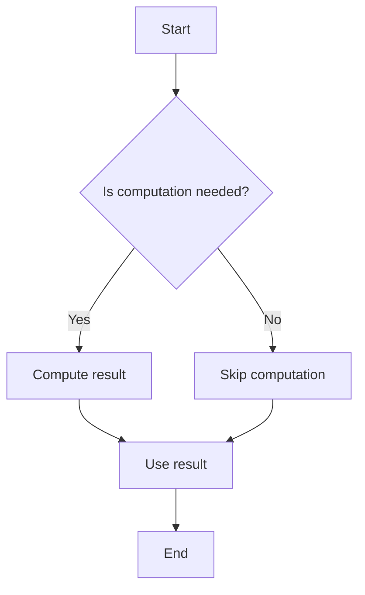

## 5.4. Practical Applications

Lazy evaluation is a powerful concept in functional programming that can significantly enhance performance and efficiency. By deferring computations until their results are needed, lazy evaluation helps avoid unnecessary calculations, leading to more efficient code execution. In this section, we will explore the practical applications of lazy evaluation, focusing on performance optimization and the prevention of redundant computations.

### Performance Optimization with Laziness

Lazy evaluation can optimize performance by reducing the computational overhead associated with eager evaluation. In eager evaluation, expressions are evaluated as soon as they are bound to a variable, which can lead to unnecessary computations if the results are never used. Lazy evaluation, on the other hand, delays the computation until the value is actually required, thus saving resources.

#### Example: Data Processing

Consider a scenario where you need to process a large dataset to extract a small subset of data. With lazy evaluation, you can construct a potentially infinite data structure and only compute the elements you need. This approach is particularly useful in data processing pipelines where intermediate results may not be necessary.

**Haskell Example:**

```haskell
let list = [1..1000000]
let firstFive = take 5 list -- Only the first five elements are computed
```

In this Haskell example, the list `[1..1000000]` is defined lazily. The `take 5` function extracts only the first five elements, and due to lazy evaluation, only these elements are computed, optimizing performance.

**JavaScript Example:**

```javascript
const numbers = (function* () {
  let n = 1;
  while (true) {
    yield n++;
  }
})();

const firstFive = Array.from({ length: 5 }, () => numbers.next().value);
console.log(firstFive); // [1, 2, 3, 4, 5]
```

In JavaScript, using a generator function allows us to create an infinite sequence of numbers. The `Array.from` method is used to lazily extract the first five numbers, demonstrating how lazy evaluation can be implemented in a language that is not inherently lazy.

### Avoiding Unnecessary Computations

Lazy evaluation is particularly effective in scenarios where not all parts of a computation are needed. By avoiding the execution of code that is never used, lazy evaluation conserves computational resources and improves efficiency.

#### Example: Conditional Computations

Suppose you have a function that performs multiple computations, but only one result is needed based on a condition. With lazy evaluation, only the necessary computation is performed.

**Haskell Example:**

```haskell
let expensiveComputation = [x^2 | x <- [1..], x `mod` 2 == 0]
let result = take 1 expensiveComputation -- Only computes the first even square
```

In this example, the list comprehension generates squares of even numbers. However, only the first even square is computed due to lazy evaluation, avoiding unnecessary calculations.

**JavaScript Example:**

```javascript
const expensiveComputation = (function* () {
  let n = 1;
  while (true) {
    if (n % 2 === 0) yield n * n;
    n++;
  }
})();

const firstEvenSquare = expensiveComputation.next().value;
console.log(firstEvenSquare); // 4
```

Here, a generator function is used to yield squares of even numbers. The first even square is computed lazily, demonstrating how unnecessary computations are avoided.

### Visual Aids

To better understand how lazy evaluation optimizes performance, consider the following diagram illustrating the process:



This diagram shows the decision-making process in lazy evaluation. If a computation is needed, it is performed; otherwise, it is skipped, leading to performance optimization.

### Practical Exercises

To reinforce your understanding of lazy evaluation, try the following exercises:

1. **Exercise 1: Lazy List Processing**
   - Implement a lazy list in Haskell that generates Fibonacci numbers. Extract the first 10 Fibonacci numbers using lazy evaluation.

2. **Exercise 2: Conditional Computation in JavaScript**
   - Create a generator function in JavaScript that yields prime numbers. Use lazy evaluation to find the first 5 prime numbers greater than 100.

### Conclusion

Lazy evaluation is a cornerstone of functional programming that offers significant performance benefits by avoiding unnecessary computations. By deferring calculations until their results are needed, lazy evaluation optimizes resource usage and enhances efficiency. Understanding and applying lazy evaluation can lead to more effective and performant functional programming solutions.

### References

- "High Performance Haskell" by John Launchbury.
- "Functional Reactive Programming" by Stephen Blackheath and Anthony Jones.

## Quiz Time!



### What is the primary benefit of lazy evaluation in functional programming?

- [x] It avoids unnecessary computations.
- [ ] It makes code execution faster by default.
- [ ] It simplifies syntax.
- [ ] It enhances type safety.

> **Explanation:** Lazy evaluation defers computations until their results are needed, avoiding unnecessary calculations and optimizing performance.

### In Haskell, what does the expression `take 5 [1..1000000]` demonstrate?

- [x] Lazy evaluation by computing only the first five elements.
- [ ] Eager evaluation by computing all elements.
- [ ] Infinite loop due to large range.
- [ ] Syntax error.

> **Explanation:** The expression demonstrates lazy evaluation by computing only the first five elements of the list.

### How does lazy evaluation help in conditional computations?

- [x] It only computes results that are needed based on conditions.
- [ ] It precomputes all possible results.
- [ ] It ignores conditions and computes everything.
- [ ] It uses eager evaluation for conditions.

> **Explanation:** Lazy evaluation computes only the necessary results based on conditions, avoiding unnecessary computations.

### Which of the following is a key feature of lazy evaluation?

- [x] Delaying computation until needed.
- [ ] Immediate computation of all expressions.
- [ ] Automatic parallel execution.
- [ ] Enhanced error handling.

> **Explanation:** Lazy evaluation delays computation until the result is required, optimizing resource usage.

### In JavaScript, how can lazy evaluation be implemented?

- [x] Using generator functions.
- [ ] Using async/await.
- [ ] Using promises.
- [ ] Using callbacks.

> **Explanation:** Generator functions in JavaScript allow for lazy evaluation by yielding values on demand.

### What is the result of `Array.from({ length: 5 }, () => numbers.next().value)` in the provided JavaScript example?

- [x] [1, 2, 3, 4, 5]
- [ ] [1, 3, 5, 7, 9]
- [ ] [2, 4, 6, 8, 10]
- [ ] [5, 4, 3, 2, 1]

> **Explanation:** The generator yields numbers starting from 1, and the first five values are extracted lazily.

### Why is lazy evaluation particularly useful in data processing pipelines?

- [x] It processes only the necessary data, optimizing performance.
- [ ] It processes all data upfront, ensuring completeness.
- [ ] It simplifies data transformation.
- [ ] It enhances data security.

> **Explanation:** Lazy evaluation processes only the necessary data, avoiding unnecessary computations and optimizing performance.

### What does the `yield` keyword do in a JavaScript generator function?

- [x] Pauses the function and returns a value.
- [ ] Ends the function execution.
- [ ] Throws an error.
- [ ] Calls another function.

> **Explanation:** The `yield` keyword pauses the generator function and returns a value, allowing for lazy evaluation.

### How does lazy evaluation contribute to performance optimization?

- [x] By deferring computations until needed, reducing resource usage.
- [ ] By executing all computations in parallel.
- [ ] By simplifying code syntax.
- [ ] By enhancing type inference.

> **Explanation:** Lazy evaluation defers computations until needed, reducing unnecessary resource usage and optimizing performance.

### True or False: Lazy evaluation can lead to infinite loops if not managed properly.

- [x] True
- [ ] False

> **Explanation:** Lazy evaluation can lead to infinite loops if the termination condition is not properly defined or managed.


