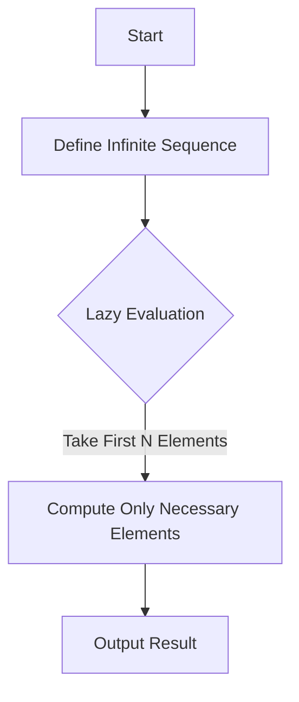

## 5.5. Practical Exercises

In this section, we delve into practical exercises that will solidify your understanding of lazy evaluation and infinite data structures in functional programming. These exercises are designed to help you apply the concepts discussed in the previous sections, providing hands-on experience with lazy functions and infinite sequences. By the end of these exercises, you should be able to efficiently handle large datasets and create infinite data structures using functional programming techniques.

### Implementing Lazy Functions

Lazy evaluation is a powerful feature in functional programming that allows computations to be deferred until their results are needed. This can lead to significant performance improvements, especially when dealing with large datasets or potentially infinite sequences. Let's explore some exercises to implement lazy functions.

#### Exercise 1: Lazy Evaluation in Haskell

**Task:** Create an infinite list of even numbers and retrieve the first 10 elements.

```haskell
-- Define an infinite list of even numbers
evens :: [Integer]
evens = [2,4..]

-- Take the first 10 even numbers
firstTenEvens :: [Integer]
firstTenEvens = take 10 evens

main :: IO ()
main = print firstTenEvens
```

**Explanation:** In Haskell, lists are inherently lazy, meaning that elements are only computed as needed. The list `evens` is defined as an infinite sequence of even numbers starting from 2. The `take` function is used to extract the first 10 elements, demonstrating lazy evaluation by only computing the necessary values.

### Creating and Manipulating Infinite Data Structures

Infinite data structures, such as streams or generators, allow you to represent sequences that can be computed on-the-fly. These structures are particularly useful when dealing with large or unbounded datasets.

#### Exercise 2: Fibonacci Sequence Generator in JavaScript

**Task:** Create a generator for Fibonacci numbers and retrieve the first 10 numbers.

```javascript
// Define a generator function for Fibonacci numbers
function* fibonacci() {
  let a = 0, b = 1;
  while (true) {
    yield a;
    [a, b] = [b, a + b];
  }
}

// Create a generator instance
const fibGen = fibonacci();

// Retrieve the first 10 Fibonacci numbers
const firstTenFib = Array.from({ length: 10 }, () => fibGen.next().value);
console.log(firstTenFib); // Output: [0, 1, 1, 2, 3, 5, 8, 13, 21, 34]
```

**Explanation:** In JavaScript, generators provide a way to implement lazy sequences. The `fibonacci` generator function yields Fibonacci numbers indefinitely. By using `Array.from` with a specified length, we can extract the first 10 numbers from the generator, showcasing how to work with infinite sequences in JavaScript.

### Visual Aids

To better understand the creation and manipulation of infinite data structures, let's use a diagram to illustrate the flow of data in these exercises.



**Explanation:** This diagram represents the process of defining an infinite sequence, applying lazy evaluation to compute only the necessary elements, and outputting the result. It highlights the efficiency of lazy evaluation in handling infinite data structures.

### Practical Applications

These exercises demonstrate the practical applications of lazy evaluation and infinite data structures in functional programming:

- **Performance Optimization:** By deferring computations, lazy evaluation can significantly reduce memory usage and improve performance, especially when dealing with large datasets.
- **Real-Time Data Processing:** Infinite data structures are ideal for real-time data processing tasks, where data is continuously generated and consumed.
- **Functional Design Patterns:** Understanding lazy evaluation and infinite sequences is crucial for implementing functional design patterns that emphasize immutability and composability.

### Summary of Key Points

- Lazy evaluation allows computations to be deferred until their results are needed, optimizing performance and memory usage.
- Infinite data structures, such as streams or generators, enable the representation of unbounded sequences that can be computed on-the-fly.
- Practical exercises in Haskell and JavaScript illustrate the implementation of lazy functions and infinite sequences, reinforcing the concepts discussed in this chapter.

### References

- "Functional Programming in Scala" by Paul Chiusano and Rúnar Bjarnason.
- "Functional Programming in JavaScript" by Luis Atencio.

## Quiz Time!



### What is lazy evaluation?

- [x] A technique where computations are deferred until their results are needed
- [ ] A method of pre-computing all possible results
- [ ] A way to avoid computations entirely
- [ ] A technique for optimizing imperative code

> **Explanation:** Lazy evaluation defers computations until their results are needed, optimizing performance and memory usage.

### Which language feature in Haskell supports lazy evaluation?

- [x] Lists
- [ ] Arrays
- [ ] HashMaps
- [ ] Strings

> **Explanation:** In Haskell, lists are inherently lazy, meaning elements are computed as needed.

### What does the `take` function do in Haskell?

- [x] Extracts a specified number of elements from a list
- [ ] Removes elements from a list
- [ ] Adds elements to a list
- [ ] Sorts a list

> **Explanation:** The `take` function extracts a specified number of elements from a list, demonstrating lazy evaluation.

### How do generators in JavaScript support lazy evaluation?

- [x] By yielding values one at a time as requested
- [ ] By pre-computing all values in advance
- [ ] By storing all values in memory
- [ ] By avoiding computations entirely

> **Explanation:** Generators yield values one at a time as requested, supporting lazy evaluation.

### What is the output of the JavaScript Fibonacci generator for the first 10 numbers?

- [x] [0, 1, 1, 2, 3, 5, 8, 13, 21, 34]
- [ ] [1, 1, 2, 3, 5, 8, 13, 21, 34, 55]
- [ ] [0, 1, 2, 3, 4, 5, 6, 7, 8, 9]
- [ ] [1, 2, 3, 4, 5, 6, 7, 8, 9, 10]

> **Explanation:** The generator yields the Fibonacci sequence starting from 0, producing [0, 1, 1, 2, 3, 5, 8, 13, 21, 34] for the first 10 numbers.

### What is an advantage of using infinite data structures?

- [x] They allow for real-time data processing
- [ ] They require infinite memory
- [ ] They are only useful for small datasets
- [ ] They avoid all computations

> **Explanation:** Infinite data structures are ideal for real-time data processing tasks, where data is continuously generated and consumed.

### How does lazy evaluation optimize performance?

- [x] By deferring computations until results are needed
- [ ] By pre-computing all results
- [ ] By using more memory
- [ ] By avoiding all computations

> **Explanation:** Lazy evaluation optimizes performance by deferring computations until results are needed, reducing memory usage.

### What is the purpose of the `yield` keyword in JavaScript generators?

- [x] To produce a value and pause execution
- [ ] To terminate the generator
- [ ] To pre-compute values
- [ ] To store values in memory

> **Explanation:** The `yield` keyword produces a value and pauses execution, allowing for lazy evaluation in generators.

### Which of the following is a practical application of lazy evaluation?

- [x] Performance optimization
- [ ] Increasing memory usage
- [ ] Pre-computing all possible results
- [ ] Avoiding all computations

> **Explanation:** Lazy evaluation optimizes performance by deferring computations, especially useful for large datasets.

### True or False: Lazy evaluation can lead to significant performance improvements.

- [x] True
- [ ] False

> **Explanation:** True. Lazy evaluation can significantly improve performance by deferring computations until results are needed.


