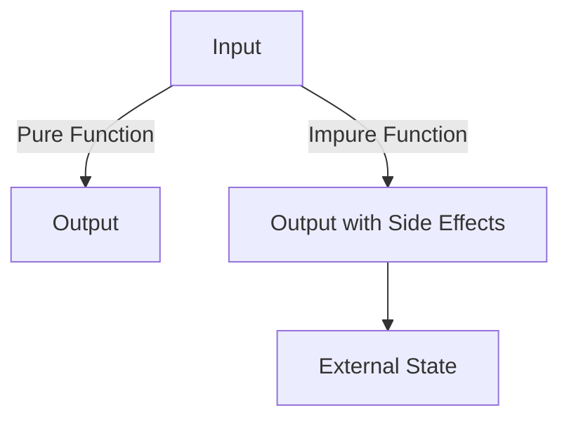

## 6.1. Pure Functions and Side Effects

In the realm of functional programming, understanding the distinction between pure functions and side effects is crucial for writing predictable and maintainable code. This section delves into the nature of side effects, their impact on code predictability, and how pure functions can help mitigate these issues.

### Understanding Side Effects in Programming

Side effects in programming refer to any operation performed by a function that affects the outside world or its environment. These effects can include modifying a global variable, performing input/output (I/O) operations, changing mutable data, or interacting with external systems. While side effects are sometimes necessary, they can introduce unpredictability into your codebase.

#### Examples of Side Effects

- **Modifying Global Variables:** Changing the state of a variable that exists outside the function's scope.
- **Performing I/O Operations:** Reading from or writing to files, databases, or network resources.
- **Changing Mutable Data:** Altering the contents of data structures that are shared across different parts of a program.

### The Impact of Side Effects on Code Predictability

Side effects can lead to unpredictable behavior, making code harder to test and maintain. When a function's output depends not only on its input parameters but also on external factors, it becomes challenging to reason about its behavior. This unpredictability can result in bugs that are difficult to trace and fix.

#### Challenges Introduced by Side Effects

- **Testing Complexity:** Functions with side effects require complex setup and teardown procedures to simulate the external environment.
- **Maintenance Difficulties:** Code with side effects is often tightly coupled, making it harder to modify or extend without introducing new bugs.
- **Reduced Reusability:** Functions that rely on external state are less reusable, as they cannot be easily isolated and reused in different contexts.

### Pure Functions: A Solution to Side Effects

Pure functions are a cornerstone of functional programming. They are defined by two key characteristics:

1. **Determinism:** A pure function always produces the same output given the same input.
2. **No Side Effects:** Pure functions do not modify any external state or interact with the outside world.

By adhering to these principles, pure functions offer several advantages:

- **Predictability:** Pure functions are easy to reason about, as their behavior is entirely determined by their input parameters.
- **Testability:** Testing pure functions is straightforward, as they do not depend on external state or side effects.
- **Reusability:** Pure functions can be easily reused across different parts of a program without concern for unintended interactions.

### Visual Aids

To better understand the distinction between pure and impure functions, consider the following diagram:



In this diagram, a pure function transforms input directly into output without affecting external state, while an impure function produces output and alters external state, introducing side effects.

### Code Snippets

Let's explore examples of pure and impure functions in Scala to illustrate these concepts:

#### Impure Function in Scala

The following Scala function is impure because it modifies a global variable:

```scala
var count = 0
def increment(): Int = {
  count += 1
  count
}
```

In this example, the `increment` function changes the state of the `count` variable, introducing a side effect.

#### Pure Function in Scala

In contrast, the following function is pure, as it does not rely on or modify any external state:

```scala
def add(x: Int, y: Int): Int = x + y
```

The `add` function simply returns the sum of its two input parameters, ensuring predictability and ease of testing.

### References

For further reading on pure functions and functional programming, consider the following resources:

- "Pure Functional Programming" by Noel Welsh and Dave Gurnell.
- "Functional Programming in Scala" by Paul Chiusano and Rúnar Bjarnason.

These texts provide in-depth insights into the principles of functional programming and the benefits of writing pure functions.

## Quiz Time!



### What is a side effect in programming?

- [x] An operation that affects the outside world or its environment
- [ ] A function that returns a value
- [ ] A variable that is declared within a function
- [ ] A loop that iterates over a collection

> **Explanation:** A side effect refers to any operation that affects the outside world or its environment, such as modifying a global variable or performing I/O operations.

### Why are side effects problematic in code?

- [x] They make code harder to test and maintain
- [ ] They improve code performance
- [ ] They increase code readability
- [ ] They simplify debugging

> **Explanation:** Side effects can lead to unpredictable behavior, making code harder to test and maintain due to dependencies on external state.

### What is a pure function?

- [x] A function that always produces the same output given the same input and has no side effects
- [ ] A function that modifies global variables
- [ ] A function that performs I/O operations
- [ ] A function that uses mutable data structures

> **Explanation:** A pure function is deterministic and does not produce side effects, ensuring predictability and ease of testing.

### Which of the following is a characteristic of pure functions?

- [x] Determinism
- [ ] Modifying external state
- [ ] Performing network requests
- [ ] Changing mutable data

> **Explanation:** Pure functions are deterministic, meaning they always produce the same output for the same input and do not modify external state.

### What is the main advantage of using pure functions?

- [x] Predictability and ease of testing
- [ ] Increased complexity
- [ ] Dependency on external state
- [ ] Reduced code reusability

> **Explanation:** Pure functions are predictable and easy to test because they do not depend on external state or produce side effects.

### How does a pure function differ from an impure function?

- [x] A pure function has no side effects, while an impure function does
- [ ] A pure function modifies global variables, while an impure function does not
- [ ] A pure function performs I/O operations, while an impure function does not
- [ ] A pure function uses mutable data, while an impure function does not

> **Explanation:** A pure function does not produce side effects, while an impure function may modify external state or perform I/O operations.

### Which of the following is an example of a pure function in Scala?

- [x] `def add(x: Int, y: Int): Int = x + y`
- [ ] `var count = 0; def increment(): Int = { count += 1; count }`
- [ ] `def readFile(fileName: String): String = scala.io.Source.fromFile(fileName).mkString`
- [ ] `def printMessage(message: String): Unit = println(message)`

> **Explanation:** The `add` function is pure because it does not modify external state or perform side effects, returning the sum of its inputs.

### What is a common challenge when testing functions with side effects?

- [x] Complex setup and teardown procedures
- [ ] Increased code readability
- [ ] Simplified debugging
- [ ] Enhanced performance

> **Explanation:** Functions with side effects require complex setup and teardown procedures to simulate the external environment, complicating testing.

### How can pure functions improve code reusability?

- [x] By not relying on external state, making them easy to reuse in different contexts
- [ ] By modifying global variables
- [ ] By performing I/O operations
- [ ] By using mutable data structures

> **Explanation:** Pure functions do not depend on external state, allowing them to be easily reused across different parts of a program.

### True or False: Pure functions can modify global variables.

- [ ] True
- [x] False

> **Explanation:** False. Pure functions do not modify global variables or produce side effects, ensuring predictability and ease of testing.


