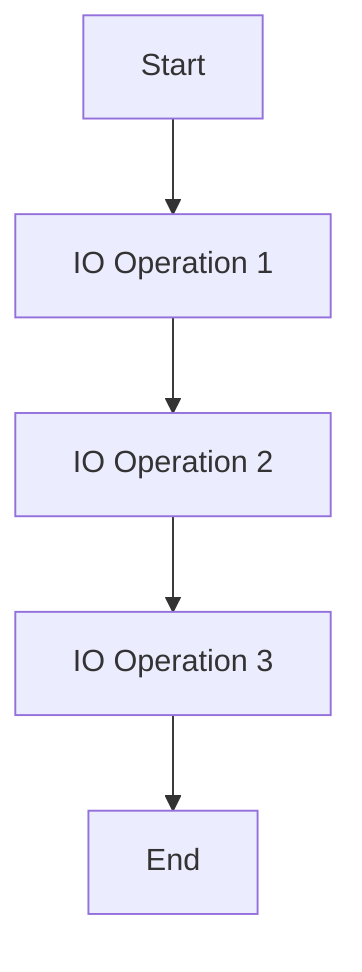

---

linkTitle: "6.2. Techniques for Handling Side Effects"
title: "Mastering Side Effects in Functional Programming: Techniques and Patterns"
description: "Explore advanced techniques for managing side effects in functional programming, including the use of monads and higher-order functions."
categories:
- Functional Programming
- Software Development
- Programming Paradigms
tags:
- Functional Programming
- Side Effects
- Monads
- Higher-Order Functions
- Code Purity
date: 2024-10-25
type: docs
nav_weight: 620000
---

## 6.2. Techniques for Handling Side Effects

In the realm of functional programming, managing side effects is crucial for maintaining code purity and predictability. Side effects, such as modifying a global state or performing I/O operations, can introduce unpredictability into programs. This section delves into advanced techniques for handling side effects effectively, ensuring that your functional code remains clean and maintainable.

### Controlling Side Effects with Functional Patterns

Functional programming offers several patterns to manage side effects in a controlled manner. One of the most powerful tools in this arsenal is the use of **monads**, particularly the IO monad, which encapsulates side effects, allowing them to be managed predictably.

#### Understanding Monads

Monads are a type of abstract data type used to represent computations instead of data in the domain model. They are a powerful way to handle side effects by encapsulating them within a controlled environment. The IO monad, for example, allows side-effecting operations to be sequenced in a functional way.

**Haskell IO Monad Example:**

```haskell
main :: IO ()
main = do
  putStrLn "Enter your name:"
  name <- getLine
  putStrLn ("Hello, " ++ name ++ "!")
```

In this Haskell example, the `IO` monad is used to handle input and output operations. The `do` notation allows for sequencing these operations while keeping them within the `IO` monad, thus maintaining purity in the rest of the program.

#### Visualizing Monad Operations

To better understand how monads manage side effects, consider the following diagram illustrating the flow of operations within a monad:



This diagram shows a sequence of IO operations encapsulated within a monad, ensuring that side effects are controlled and predictable.

### The Role of Higher-Order Functions in Managing Effects

Higher-order functions play a significant role in managing side effects by encapsulating operations that may produce side effects. By doing so, they help maintain the overall purity of the code.

#### Encapsulation with Higher-Order Functions

Higher-order functions can take other functions as arguments or return them as results. This capability allows them to encapsulate side-effect-laden operations, isolating them from the rest of the program.

**Scala Functional Effect Example (Using cats-effect):**

```scala
import cats.effect.IO

def greet: IO[Unit] = for {
  _ <- IO(println("Enter your name:"))
  name <- IO(scala.io.StdIn.readLine())
  _ <- IO(println(s"Hello, $name!"))
} yield ()
```

In this Scala example, the `cats-effect` library is used to handle side effects. The `IO` monad encapsulates the side-effecting operations, and the `for` comprehension sequences them in a functional manner.

### Practical Applications and Best Practices

- **Isolate Side Effects:** Always aim to isolate side effects from the core logic of your program. This isolation makes it easier to test and reason about your code.
- **Use Monads Wisely:** While monads are powerful, they can introduce complexity. Use them judiciously to manage side effects without overcomplicating your code.
- **Leverage Higher-Order Functions:** Utilize higher-order functions to encapsulate and manage side-effecting operations, maintaining the purity of your functional code.

### Conclusion

Managing side effects is a critical aspect of functional programming. By using monads and higher-order functions, you can control side effects effectively, ensuring that your code remains clean, predictable, and maintainable. These techniques not only enhance the reliability of your programs but also make them easier to understand and extend.

### References

- "Category Theory for Programmers" by Bartosz Milewski.
- "Effects in Functional Programming" by Haskell and Scala authors.

## Quiz Time!



### What is a monad in functional programming?

- [x] An abstract data type used to represent computations
- [ ] A type of loop structure
- [ ] A variable that holds side effects
- [ ] A function that performs I/O operations

> **Explanation:** Monads are abstract data types that represent computations, allowing side effects to be managed in a controlled manner.

### How do higher-order functions help manage side effects?

- [x] By encapsulating side-effect-laden operations
- [ ] By eliminating side effects entirely
- [ ] By converting side effects into pure functions
- [ ] By increasing the complexity of side effects

> **Explanation:** Higher-order functions encapsulate operations that may produce side effects, helping to maintain code purity.

### What is the purpose of the IO monad in Haskell?

- [x] To handle input and output operations functionally
- [ ] To perform arithmetic calculations
- [ ] To manage memory allocation
- [ ] To create graphical user interfaces

> **Explanation:** The IO monad in Haskell is used to handle input and output operations while maintaining functional purity.

### In the Scala example, what library is used to manage side effects?

- [x] cats-effect
- [ ] akka
- [ ] play
- [ ] slick

> **Explanation:** The `cats-effect` library is used in Scala to manage side effects functionally.

### What is a key benefit of using monads to handle side effects?

- [x] They provide a controlled environment for side effects
- [ ] They eliminate the need for functions
- [ ] They increase the speed of computations
- [ ] They simplify the syntax of the language

> **Explanation:** Monads provide a controlled environment for managing side effects, ensuring predictability and purity.

### Which of the following is a common pitfall when using monads?

- [x] Introducing unnecessary complexity
- [ ] Eliminating all side effects
- [ ] Simplifying code too much
- [ ] Making code run slower

> **Explanation:** While monads are powerful, they can introduce unnecessary complexity if not used judiciously.

### What is the main advantage of isolating side effects in functional programming?

- [x] Easier testing and reasoning about code
- [ ] Faster execution of programs
- [ ] Reduced memory usage
- [ ] Increased code length

> **Explanation:** Isolating side effects makes it easier to test and reason about the code, enhancing maintainability.

### How does the `for` comprehension in Scala help with side effects?

- [x] It sequences side-effecting operations functionally
- [ ] It eliminates side effects
- [ ] It converts side effects into pure functions
- [ ] It increases the complexity of side effects

> **Explanation:** The `for` comprehension in Scala sequences side-effecting operations in a functional manner, maintaining purity.

### What is a higher-order function?

- [x] A function that takes other functions as arguments or returns them as results
- [ ] A function that performs I/O operations
- [ ] A function that manages memory
- [ ] A function that calculates factorials

> **Explanation:** A higher-order function is one that takes other functions as arguments or returns them as results, allowing for greater abstraction and encapsulation.

### True or False: Monads can completely eliminate side effects from a program.

- [ ] True
- [x] False

> **Explanation:** Monads do not eliminate side effects; they encapsulate them, allowing for controlled management within a program.


