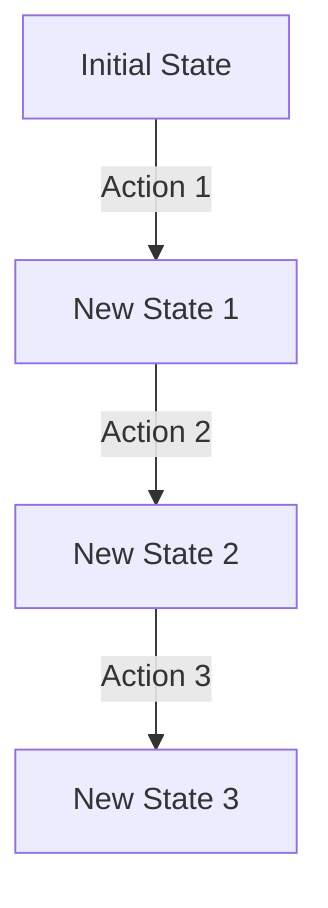

## 6.3. State Management in Functional Programming

State management is a fundamental aspect of programming, and functional programming offers unique approaches to handle state changes effectively. This section delves into the principles of immutability and state transitions, exploring how functional programming manages state without mutation. We'll also look at practical techniques and examples in Haskell and Scala to solidify these concepts.

### Immutability and State Transitions

Immutability is a cornerstone of functional programming. It refers to the practice of creating new data structures instead of modifying existing ones. This approach offers several benefits:

- **Predictability:** Since data structures do not change, functions that operate on them are easier to reason about.
- **Concurrency:** Immutability eliminates issues related to shared mutable state, making concurrent programming safer and more straightforward.
- **Debugging:** Immutable data structures simplify debugging, as the state at any point in time can be easily reconstructed.

In functional programming, state transitions are managed by creating new instances of state rather than altering the existing state. This approach ensures that each state transition is explicit and traceable.

#### Example: State Transition in an Immutable System

Consider a simple counter that increments and decrements. In an immutable system, each operation returns a new state:

```scala
case class State(count: Int)

def increment(state: State): State = state.copy(count = state.count + 1)
def decrement(state: State): State = state.copy(count = state.count - 1)
```

Here, `increment` and `decrement` functions return a new `State` instance with the updated count, leaving the original state unchanged.

### Managing State Without Mutation

Functional programming provides several techniques to manage state without mutation. Two common approaches are using state monads and immutable state containers.

#### State Monads

State monads encapsulate stateful computations, allowing state to be passed implicitly through a sequence of computations. This technique is particularly useful in Haskell.

##### Haskell State Monad Example

```haskell
import Control.Monad.State

type Stack = [Int]

push :: Int -> State Stack ()
push x = modify (x:)

pop :: State Stack (Maybe Int)
pop = do
  stack <- get
  case stack of
    [] -> return Nothing
    (x:xs) -> put xs >> return (Just x)
```

In this example, the `State` monad is used to manage a stack. The `push` function adds an element to the stack, while `pop` removes the top element. The state is threaded through the computations without explicit passing, maintaining immutability.

#### Immutable State Containers

Immutable state containers, such as those found in libraries like Redux for JavaScript, manage state by producing new state objects in response to actions. This pattern is prevalent in functional programming languages and frameworks.

### Visual Aids

To better understand state transitions in an immutable system, consider the following flowchart:



This diagram illustrates how each action results in a new state, maintaining immutability throughout the process.

### Code Snippets

Let's explore code snippets in Haskell and Scala to see these concepts in action.

#### Haskell State Monad Example

```haskell
import Control.Monad.State

type Stack = [Int]

push :: Int -> State Stack ()
push x = modify (x:)

pop :: State Stack (Maybe Int)
pop = do
  stack <- get
  case stack of
    [] -> return Nothing
    (x:xs) -> put xs >> return (Just x)
```

This Haskell example demonstrates using the `State` monad to manage a stack, encapsulating state transitions within monadic operations.

#### Scala Immutable State Example

```scala
case class State(count: Int)

def increment(state: State): State = state.copy(count = state.count + 1)
def decrement(state: State): State = state.copy(count = state.count - 1)
```

In Scala, immutability is achieved by returning new instances of the `State` class, ensuring that each state transition is explicit and traceable.

### References

- "Functional Programming in Scala" by Paul Chiusano and Rúnar Bjarnason.
- "Real World Haskell" by Bryan O'Sullivan, John Goerzen, and Don Stewart.

### Conclusion

State management in functional programming emphasizes immutability and explicit state transitions. By using techniques such as state monads and immutable state containers, functional programming provides robust solutions for managing state without mutation. These approaches not only enhance code predictability and safety but also facilitate concurrent programming.

## Quiz Time!



### What is a key benefit of immutability in functional programming?

- [x] Predictability
- [ ] Complexity
- [ ] Increased memory usage
- [ ] Slower performance

> **Explanation:** Immutability ensures that data structures do not change, making functions easier to reason about and predict.

### How does functional programming handle state transitions?

- [x] By creating new instances of state
- [ ] By modifying existing state
- [ ] By using global variables
- [ ] By using pointers

> **Explanation:** Functional programming handles state transitions by creating new instances of state, maintaining immutability.

### What is a state monad used for in Haskell?

- [x] To encapsulate stateful computations
- [ ] To perform I/O operations
- [ ] To handle exceptions
- [ ] To manage memory

> **Explanation:** A state monad in Haskell is used to encapsulate stateful computations, allowing state to be passed implicitly.

### In the Scala example, how is immutability achieved?

- [x] By returning new instances of the `State` class
- [ ] By modifying the existing `State` instance
- [ ] By using mutable variables
- [ ] By using global state

> **Explanation:** Immutability is achieved by returning new instances of the `State` class, ensuring explicit state transitions.

### What is a common technique for managing state without mutation in functional programming?

- [x] Using state monads
- [ ] Using global variables
- [ ] Using mutable objects
- [ ] Using pointers

> **Explanation:** State monads are a common technique for managing state without mutation in functional programming.

### What does the `push` function do in the Haskell example?

- [x] Adds an element to the stack
- [ ] Removes an element from the stack
- [ ] Clears the stack
- [ ] Reverses the stack

> **Explanation:** The `push` function adds an element to the stack by modifying the state within the state monad.

### What does the `pop` function return in the Haskell example when the stack is empty?

- [x] `Nothing`
- [ ] `Just 0`
- [ ] `Just []`
- [ ] `Just x`

> **Explanation:** The `pop` function returns `Nothing` when the stack is empty, indicating no element to pop.

### What is the purpose of the `modify` function in the Haskell example?

- [x] To update the state within the state monad
- [ ] To perform I/O operations
- [ ] To handle exceptions
- [ ] To manage memory

> **Explanation:** The `modify` function updates the state within the state monad, allowing state transitions.

### In the Scala example, what does the `copy` method do?

- [x] Creates a new instance of the `State` class with updated values
- [ ] Modifies the existing `State` instance
- [ ] Deletes the `State` instance
- [ ] Reverses the `State` instance

> **Explanation:** The `copy` method creates a new instance of the `State` class with updated values, maintaining immutability.

### True or False: Immutability simplifies debugging in functional programming.

- [x] True
- [ ] False

> **Explanation:** True. Immutability simplifies debugging because the state at any point in time can be easily reconstructed.


