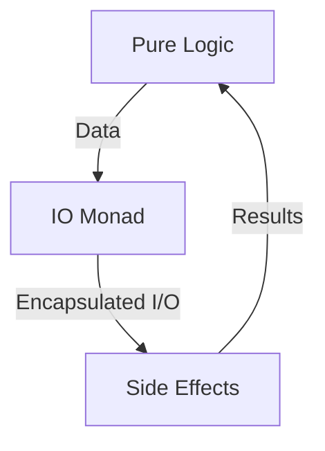

---

linkTitle: "6.4. Functional Approaches to I/O"
title: "Functional Programming Approaches to I/O: Isolating Side Effects for Pure Logic"
description: "Explore how functional programming handles input and output operations by isolating side effects, ensuring core logic remains pure and maintainable."
categories:
- Functional Programming
- Input/Output
- Software Development
tags:
- Functional Programming
- I/O Operations
- Monads
- Haskell
- Scala
date: 2024-10-25
type: docs
nav_weight: 6400

---

## 6.4. Functional Approaches to I/O

In functional programming, managing input and output (I/O) operations presents a unique challenge. Unlike imperative programming, where side effects are common, functional programming emphasizes purity and immutability. This section explores how functional programming handles I/O operations by isolating them from pure code, ensuring that the core logic remains side-effect-free.

### Handling Input and Output Functionally

Functional programming languages strive to maintain purity by treating functions as mathematical entities that produce the same output for the same input without side effects. However, real-world applications require interaction with the outside world, such as reading user input or writing to a file. To reconcile this, functional programming employs strategies to isolate side effects from the pure logic of the program.

#### The Role of Monads in I/O

Monads are a powerful abstraction in functional programming that allow for the encapsulation of side effects, including I/O operations. By using monads, we can sequence operations while maintaining the purity of our functions. The IO monad in Haskell, for example, provides a way to handle I/O operations without compromising the functional nature of the language.

### Isolating Side Effects from Pure Logic

To isolate side effects, functional programming languages often use monads to encapsulate operations that interact with the external environment. This approach allows developers to write pure functions that describe what should happen, while the monad handles the execution of these operations.

#### Using Monads to Encapsulate I/O

Monads provide a framework for chaining operations while keeping side effects contained. In Haskell, the IO monad is used to perform I/O operations in a controlled manner. Here's a simple example:

```haskell
main :: IO ()
main = do
  putStrLn "What's your favorite color?"
  color <- getLine
  putStrLn ("Your favorite color is " ++ color ++ ".")
```

In this example, the `main` function is of type `IO ()`, indicating that it performs I/O operations. The `do` notation allows us to sequence these operations, with each line representing an action within the IO monad.

#### Scala Functional I/O with Cats-Effect

Scala, with its rich ecosystem of libraries, provides similar capabilities through the `cats-effect` library. Here's how you can handle I/O operations functionally in Scala:

```scala
import cats.effect.IO

def askColor: IO[String] = IO {
  println("What's your favorite color?")
  scala.io.StdIn.readLine()
}

def printColor(color: String): IO[Unit] = IO {
  println(s"Your favorite color is $color.")
}

def program: IO[Unit] = for {
  color <- askColor
  _     <- printColor(color)
} yield ()

def main(args: Array[String]): Unit = program.unsafeRunSync()
```

In this Scala example, `IO` is used to encapsulate side effects. The `for` comprehension allows us to sequence operations, similar to Haskell's `do` notation. The `unsafeRunSync()` method is used to execute the program, acknowledging that side effects will occur.

### Visual Aids

To better understand the separation of pure logic and side-effectful I/O operations, consider the following diagram:



This diagram illustrates how pure logic interacts with the IO monad to perform side effects, ensuring that the core logic remains unaffected by external interactions.

### Practical Exercises

To reinforce these concepts, try the following exercises:

1. **Haskell Exercise:**
   - Modify the Haskell example to ask for the user's name and greet them with a personalized message.

2. **Scala Exercise:**
   - Extend the Scala example to include error handling for invalid input, using the `cats-effect` library.

### Conclusion

Functional programming offers robust techniques for handling I/O operations while maintaining purity and immutability. By isolating side effects using monads, developers can write clean, maintainable code that interacts with the external world in a controlled manner. Understanding these concepts is crucial for building reliable functional applications.

### Further Reading

- "Programming in Haskell" by Graham Hutton
- "Functional Programming in Scala" by Paul Chiusano and Rúnar Bjarnason

## Quiz Time!



### What is the primary challenge of handling I/O in functional programming?

- [x] Maintaining purity while performing side effects
- [ ] Ensuring type safety
- [ ] Optimizing performance
- [ ] Simplifying syntax

> **Explanation:** The main challenge is to maintain the purity of functions while performing necessary side effects like I/O operations.

### How do monads help in managing I/O operations in functional programming?

- [x] By encapsulating side effects
- [ ] By improving performance
- [ ] By simplifying syntax
- [ ] By ensuring type safety

> **Explanation:** Monads encapsulate side effects, allowing functional programs to sequence operations without compromising purity.

### In Haskell, what does the `IO` type represent?

- [x] A monad for handling I/O operations
- [ ] A data type for integers
- [ ] A function type
- [ ] A type for strings

> **Explanation:** The `IO` type in Haskell is a monad used to handle I/O operations while maintaining function purity.

### What is the purpose of the `do` notation in Haskell?

- [x] To sequence monadic operations
- [ ] To define functions
- [ ] To declare variables
- [ ] To optimize performance

> **Explanation:** The `do` notation is used to sequence operations within a monad, such as the IO monad in Haskell.

### Which library in Scala provides functional I/O capabilities?

- [x] cats-effect
- [ ] akka
- [ ] play
- [ ] slick

> **Explanation:** The `cats-effect` library in Scala provides functional I/O capabilities, allowing for the encapsulation of side effects.

### What does the `unsafeRunSync()` method do in Scala's `cats-effect` library?

- [x] Executes an IO operation, acknowledging side effects
- [ ] Compiles the program
- [ ] Optimizes the code
- [ ] Ensures type safety

> **Explanation:** The `unsafeRunSync()` method executes an IO operation, acknowledging that side effects will occur.

### How does functional programming ensure that core logic remains side-effect-free?

- [x] By isolating side effects using monads
- [ ] By using loops
- [ ] By optimizing performance
- [ ] By simplifying syntax

> **Explanation:** Functional programming isolates side effects using monads, ensuring that core logic remains pure and side-effect-free.

### What is the benefit of using monads for I/O operations?

- [x] They allow sequencing of operations while maintaining purity
- [ ] They improve performance
- [ ] They simplify syntax
- [ ] They ensure type safety

> **Explanation:** Monads allow for the sequencing of operations while maintaining the purity of functions, which is essential in functional programming.

### In the provided Haskell example, what does the `getLine` function do?

- [x] Reads a line of input from the user
- [ ] Writes a line of output to the console
- [ ] Declares a variable
- [ ] Compiles the program

> **Explanation:** The `getLine` function reads a line of input from the user in Haskell.

### True or False: In functional programming, side effects are completely avoided.

- [ ] True
- [x] False

> **Explanation:** While functional programming aims to minimize side effects, they are not completely avoided. Instead, they are isolated and managed using constructs like monads.


