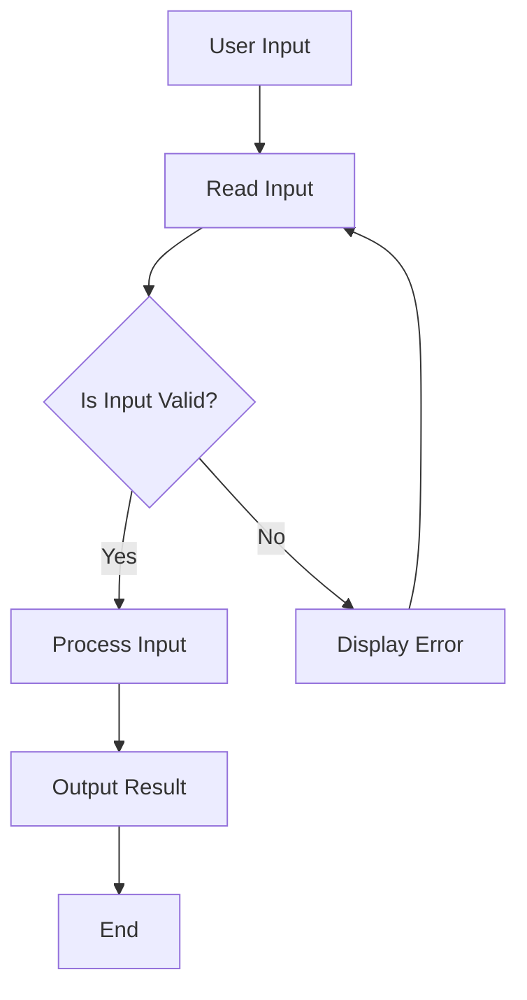

## 6.5. Practical Applications

In functional programming, managing side effects and state is crucial for maintaining the purity and predictability of functions. This section explores practical applications of these concepts, focusing on implementing side-effect-free I/O operations and processing user input functionally. By isolating side effects, we can write cleaner, more maintainable code that adheres to functional principles.

### Implementing Side-Effect-Free I/O Operations

Functional programming languages often use monads or similar constructs to handle side effects such as I/O operations. These constructs allow us to encapsulate side effects, maintaining the purity of our functions while still interacting with the outside world.

#### Haskell Example: I/O with Monads

In Haskell, the `IO` monad is used to handle input and output operations. The following example demonstrates how to read a number from the user and display it back, all while keeping the side effects contained within the `IO` monad:

```haskell
main :: IO ()
main = do
  putStrLn "Enter a number:"
  input <- getLine
  let number = read input :: Int
  putStrLn ("You entered: " ++ show number)
```

In this example, `getLine` is an I/O action that reads a line from the standard input. The `do` notation allows us to sequence these actions while keeping the side effects isolated within the `IO` monad.

#### JavaScript Example: Functional I/O with Ramda

JavaScript, being a multi-paradigm language, can also adopt functional programming patterns using libraries like Ramda. Here's how you can implement a similar I/O operation in JavaScript:

```javascript
const R = require('ramda');
const askNumber = () => {
  const readline = require('readline').createInterface({
    input: process.stdin,
    output: process.stdout
  });
  return new Promise(resolve => {
    readline.question('Enter a number: ', answer => {
      readline.close();
      resolve(parseInt(answer, 10));
    });
  });
};

const displayNumber = (number) => {
  console.log(`You entered: ${number}`);
};

const program = async () => {
  const number = await askNumber();
  displayNumber(number);
};

program();
```

In this JavaScript example, we use Promises to handle asynchronous I/O operations. The `askNumber` function reads input from the user, and `displayNumber` outputs the result. By using functional patterns, we can keep our code clean and modular.

### Example: Reading User Input Functionally

Let's delve deeper into a complete example of reading user input, processing it functionally, and producing output without compromising function purity. We'll use Haskell for this demonstration, leveraging its strong type system and functional capabilities.

#### Haskell: Functional User Input Processing

```haskell
import Control.Monad (when)

main :: IO ()
main = do
  putStrLn "Enter a number (or 'exit' to quit):"
  input <- getLine
  when (input /= "exit") $ do
    let maybeNumber = safeRead input
    case maybeNumber of
      Just number -> putStrLn ("You entered: " ++ show number)
      Nothing -> putStrLn "Invalid input, please enter a valid number."
    main

safeRead :: Read a => String -> Maybe a
safeRead s = case reads s of
  [(val, "")] -> Just val
  _           -> Nothing
```

In this example, we use a helper function `safeRead` to safely parse the input string into a number. If the input is invalid, we provide feedback to the user and prompt for input again. This approach ensures that our program handles errors gracefully without breaking the flow of execution.

### Visual Aids

To better understand the flow of data in a functional I/O operation, consider the following diagram:



This diagram illustrates the process of reading user input, validating it, processing it if valid, and handling errors if not. The loop back to reading input ensures that the program continues to prompt the user until valid input is received.

### Practical Applications in Industry

Managing side effects and state functionally is not just an academic exercise; it has real-world applications in software development. By isolating side effects, developers can create more reliable and maintainable systems. This approach is particularly beneficial in environments where predictability and robustness are critical, such as financial systems, data processing pipelines, and distributed systems.

### Summary of Key Points

- Functional programming provides tools and patterns to manage side effects and state effectively.
- Using constructs like monads in Haskell or functional libraries in JavaScript, we can perform I/O operations while maintaining function purity.
- Practical applications of these concepts lead to more maintainable and reliable code, which is crucial in real-world software development.

### References

- "Functional Programming in JavaScript" by Luis Atencio.
- "Real World Haskell" by Bryan O'Sullivan, John Goerzen, and Don Stewart.

## Quiz Time!



### What is the primary purpose of using monads in functional programming?

- [x] To encapsulate side effects and maintain function purity
- [ ] To improve performance of functional programs
- [ ] To simplify syntax in functional languages
- [ ] To enable parallel processing

> **Explanation:** Monads are used to encapsulate side effects, allowing functions to remain pure while still interacting with the outside world.

### In the Haskell example, what does the `do` notation achieve?

- [x] It sequences I/O actions while keeping side effects isolated
- [ ] It improves the performance of the program
- [ ] It allows for parallel execution of code
- [ ] It simplifies error handling

> **Explanation:** The `do` notation in Haskell is used to sequence actions, particularly I/O actions, while maintaining the purity of the functions involved.

### How does the JavaScript example handle asynchronous I/O operations?

- [x] By using Promises to manage asynchronous behavior
- [ ] By using callbacks to handle I/O operations
- [ ] By using synchronous blocking calls
- [ ] By using threads for parallel execution

> **Explanation:** The JavaScript example uses Promises to handle asynchronous I/O operations, allowing for non-blocking execution.

### What is the role of the `safeRead` function in the Haskell example?

- [x] To safely parse a string into a number, returning `Nothing` if parsing fails
- [ ] To improve the performance of the input processing
- [ ] To handle exceptions thrown during parsing
- [ ] To convert numbers into strings

> **Explanation:** The `safeRead` function attempts to parse a string into a number and returns `Nothing` if parsing is unsuccessful, thus handling invalid input gracefully.

### Which library is used in the JavaScript example to facilitate functional programming patterns?

- [x] Ramda
- [ ] Lodash
- [ ] Underscore
- [ ] jQuery

> **Explanation:** The JavaScript example uses the Ramda library, which provides functional programming utilities.

### What is a key benefit of isolating side effects in functional programming?

- [x] Improved code maintainability and reliability
- [ ] Increased execution speed
- [ ] Reduced memory usage
- [ ] Enhanced graphical user interfaces

> **Explanation:** Isolating side effects leads to improved maintainability and reliability, as the code becomes more predictable and easier to reason about.

### In the provided Mermaid.js diagram, what happens if the input is invalid?

- [x] An error message is displayed, and the program prompts for input again
- [ ] The program terminates immediately
- [ ] The program continues without processing the input
- [ ] The program logs the error and proceeds

> **Explanation:** If the input is invalid, an error message is displayed, and the program loops back to prompt the user for input again.

### What is the significance of using functional patterns for I/O operations in JavaScript?

- [x] It helps keep the code modular and clean
- [ ] It increases the speed of I/O operations
- [ ] It allows for synchronous execution
- [ ] It reduces the size of the codebase

> **Explanation:** Using functional patterns helps keep the code modular and clean, making it easier to maintain and extend.

### Which of the following is a common use case for managing side effects functionally in industry?

- [x] Financial systems
- [ ] Video game development
- [ ] Graphic design software
- [ ] Social media applications

> **Explanation:** Financial systems often require high reliability and predictability, making functional management of side effects particularly beneficial.

### True or False: Functional programming can only be applied in purely functional languages.

- [x] False
- [ ] True

> **Explanation:** Functional programming principles can be applied in multi-paradigm languages like JavaScript, allowing developers to leverage functional patterns even in non-purely functional languages.


