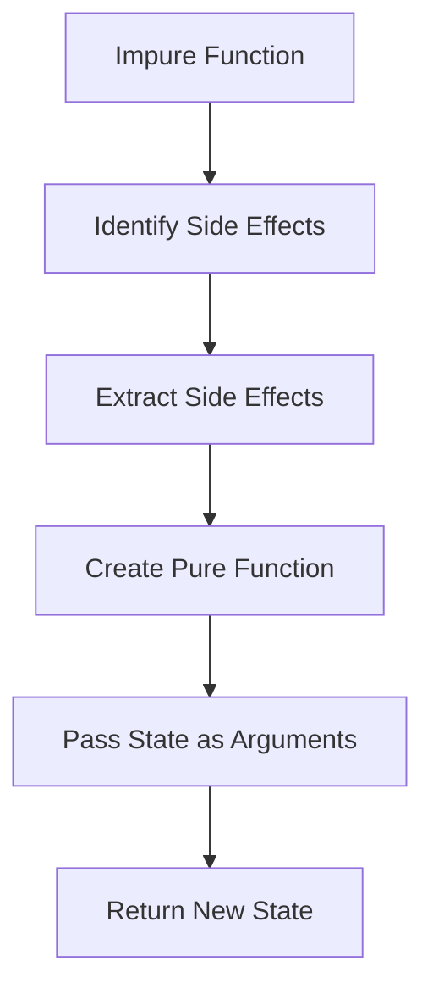

---

linkTitle: "6.6. Practical Exercises"
title: "Functional Programming Exercises: Managing Side Effects and State"
description: "Explore practical exercises to refactor impure code, manage state functionally, and isolate side effects using functional programming techniques."
categories:
- Functional Programming
- Software Development
- Programming Exercises
tags:
- Functional Programming
- Side Effects
- State Management
- Code Refactoring
- Pure Functions
date: 2024-10-25
type: docs
nav_weight: 6600

---

## 6.6. Practical Exercises

In this section, we will delve into practical exercises that focus on managing side effects and state in functional programming. These exercises are designed to reinforce your understanding of how to refactor impure code into pure functions and manage state transitions without mutation. By the end of this section, you will have hands-on experience in applying functional programming principles to real-world scenarios.

### Introduction

Functional programming emphasizes the use of pure functions and immutable data structures to achieve predictable and maintainable code. One of the key challenges in functional programming is managing side effects and state changes. This section provides practical exercises to help you master these concepts by refactoring impure code and designing functions that handle state functionally.

### Refactoring Code to Isolate Side Effects

Refactoring impure code to isolate side effects is a fundamental skill in functional programming. By transforming impure functions into pure ones, you can achieve greater predictability and testability in your code.

#### Exercise 1: Refactoring Impure Code in Scala

Let's start with a simple example in Scala. Consider the following impure function:

```scala
// Impure
var total = 0
def add(x: Int): Unit = {
  total += x
}
```

This function modifies a global variable `total`, which makes it impure. Your task is to refactor this function into a pure function that does not rely on or modify external state.

**Refactored Solution:**

```scala
// Pure
def addPure(total: Int, x: Int): Int = total + x
```

In the refactored version, `addPure` takes the current `total` and the value `x` as arguments and returns a new total without modifying any external state.

#### Exercise 2: Refactoring Impure Code in JavaScript

Now, let's look at a similar example in JavaScript:

```javascript
// Impure
let balance = 100;
const withdraw = (amount) => {
  balance -= amount;
  return balance;
}
```

This function directly modifies the `balance` variable, making it impure. Refactor this function to make it pure.

**Refactored Solution:**

```javascript
// Pure
const withdrawPure = (balance, amount) => balance - amount;
```

The `withdrawPure` function now takes `balance` and `amount` as parameters and returns the new balance without altering any external state.

### Designing Functions that Manage State Functionally

Managing state transitions without mutating existing state is crucial in functional programming. This exercise will help you design functions that handle state changes functionally.

#### Exercise 3: State Management in Haskell

Consider a scenario where you need to manage a simple counter. In an imperative style, you might write:

```haskell
-- Impure
counter :: IORef Int
counter = unsafePerformIO $ newIORef 0

increment :: IO ()
increment = modifyIORef counter (+1)
```

Refactor this to a pure functional approach:

**Refactored Solution:**

```haskell
-- Pure
incrementPure :: Int -> Int
incrementPure count = count + 1
```

Here, `incrementPure` takes the current count and returns a new count, avoiding any side effects.

### Visual Aids

To better understand the transformation from impure to pure code, let's visualize the process using Mermaid.js.



This diagram illustrates the steps involved in refactoring an impure function to a pure one by isolating side effects and managing state through function arguments and return values.

### Practical Exercises

Now it's your turn to practice. Here are some exercises to apply what you've learned:

#### Exercise 4: Refactor Impure Code in Python

Given the following impure function in Python, refactor it to be pure:

```python
counter = 0

def increment():
    global counter
    counter += 1
    return counter
```

**Refactored Solution:**

```python
def increment_pure(counter):
    return counter + 1
```

#### Exercise 5: State Management in F#

Consider a function that updates a user's profile information. Refactor it to handle state transitions functionally:

```fsharp
// Impure
let mutable profile = { Name = "Alice"; Age = 30 }

let updateAge newAge =
    profile <- { profile with Age = newAge }
```

**Refactored Solution:**

```fsharp
// Pure
let updateAgePure profile newAge =
    { profile with Age = newAge }
```

### Conclusion

Through these exercises, you've practiced refactoring impure code to isolate side effects and designing functions that manage state functionally. These skills are essential for writing clean, maintainable, and predictable functional code. By mastering these techniques, you can effectively manage side effects and state transitions in your functional programming projects.

### References

- "Real World Haskell" by Bryan O'Sullivan, John Goerzen, and Don Stewart.
- "Functional Programming in Scala" by Paul Chiusano and Rúnar Bjarnason.

### Further Reading

- "Haskell Programming from First Principles" by Christopher Allen and Julie Moronuki.
- "JavaScript: The Good Parts" by Douglas Crockford.

## Quiz Time!



### What is a key benefit of refactoring impure functions into pure functions?

- [x] Improved predictability and testability
- [ ] Increased code complexity
- [ ] Reduced performance
- [ ] More side effects

> **Explanation:** Pure functions are predictable and easier to test because they do not rely on or modify external state.

### In the refactored Scala example, what does the `addPure` function return?

- [x] A new total
- [ ] The original total
- [ ] A modified global variable
- [ ] An error

> **Explanation:** The `addPure` function returns a new total by adding the given value to the current total without modifying external state.

### How does the `withdrawPure` function in JavaScript differ from the impure version?

- [x] It does not modify external state
- [ ] It uses a different algorithm
- [ ] It is less efficient
- [ ] It requires more parameters

> **Explanation:** The `withdrawPure` function does not modify the external `balance` variable, making it pure.

### What is the purpose of using Mermaid.js diagrams in this section?

- [x] To visualize the transformation process from impure to pure code
- [ ] To create complex data structures
- [ ] To generate random numbers
- [ ] To write code snippets

> **Explanation:** Mermaid.js diagrams are used to visually represent the steps involved in refactoring impure code to pure code.

### In the Haskell example, what does the `incrementPure` function do?

- [x] Returns a new count
- [ ] Modifies a global counter
- [ ] Prints the count
- [ ] Decrements the count

> **Explanation:** The `incrementPure` function returns a new count by adding one to the given count, without side effects.

### Why is managing state transitions without mutation important in functional programming?

- [x] To maintain immutability and predictability
- [ ] To increase code complexity
- [ ] To reduce performance
- [ ] To allow more side effects

> **Explanation:** Managing state transitions without mutation is important to maintain immutability and predictability in functional programming.

### What is a common technique for handling state in functional programming?

- [x] Passing state as arguments and returning new state
- [ ] Using global variables
- [ ] Modifying external state directly
- [ ] Ignoring state changes

> **Explanation:** In functional programming, state is often passed as arguments to functions and new state is returned, avoiding direct modification of external state.

### Which book is recommended for further reading on Haskell?

- [x] "Haskell Programming from First Principles"
- [ ] "JavaScript: The Good Parts"
- [ ] "Functional Programming in Scala"
- [ ] "Real World Haskell"

> **Explanation:** "Haskell Programming from First Principles" is recommended for further reading on Haskell.

### What is the main focus of this section's exercises?

- [x] Refactoring impure code and managing state functionally
- [ ] Writing complex algorithms
- [ ] Designing user interfaces
- [ ] Learning new programming languages

> **Explanation:** The main focus is on refactoring impure code to isolate side effects and designing functions that manage state functionally.

### True or False: Pure functions can modify external state.

- [ ] True
- [x] False

> **Explanation:** Pure functions cannot modify external state; they only depend on their input parameters and return new values.


