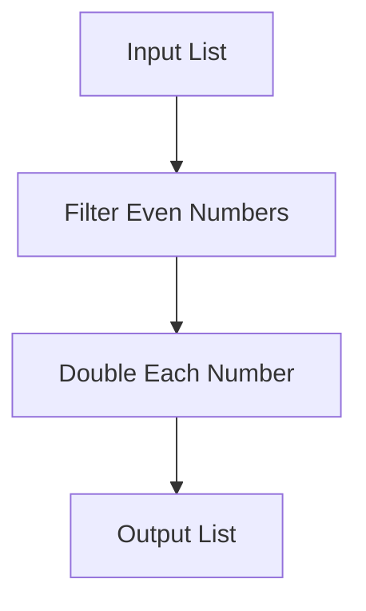

## 7.2. Building Pipelines with Function Composition

In the realm of functional programming, function composition is a powerful concept that allows developers to build complex operations by combining simpler functions. This approach not only enhances code clarity and maintainability but also promotes reusability and modularity. In this section, we will delve into the creation of data processing pipelines using function composition, explore its benefits, and provide practical examples in multiple functional programming languages.

### Creating Data Processing Pipelines

A data processing pipeline is a sequence of data transformations applied to a dataset. In functional programming, pipelines are constructed by composing functions, where the output of one function becomes the input to the next. This method is akin to an assembly line, where each stage performs a specific task, ultimately producing a refined output.

#### Example of a Data Processing Pipeline

Consider a scenario where we have a list of numbers, and we want to filter out the even numbers and then double each of them. This can be elegantly expressed using function composition:

- **Haskell:**

  ```haskell
  let process = map (*2) . filter even
  print (process [1, 2, 3, 4, 5]) -- [4, 8]
  ```

- **JavaScript (using Ramda):**

  ```javascript
  const R = require('ramda');
  
  const process = R.pipe(
    R.filter(R.even),
    R.map(x => x * 2)
  );
  
  console.log(process([1, 2, 3, 4, 5])); // [4, 8]
  ```

- **Scala:**

  ```scala
  val process = (xs: List[Int]) => xs.filter(_ % 2 == 0).map(_ * 2)
  
  println(process(List(1, 2, 3, 4, 5))) // List(4, 8)
  ```

In these examples, the `process` function is a pipeline that first filters the list to retain only even numbers and then maps over the list to double each number. This approach is concise and expressive, making the code easy to read and understand.

### Enhancing Code Reusability and Modularity

Function composition naturally leads to more reusable and modular code. By breaking down complex operations into smaller, composable functions, each function can be reused in different contexts. This modularity allows developers to build flexible systems where components can be easily swapped or extended.

#### Benefits of Modularity

1. **Isolation of Concerns:** Each function in a pipeline performs a single task, making it easier to understand and test.
2. **Reusability:** Functions can be reused across different pipelines or projects, reducing redundancy.
3. **Maintainability:** Changes to one part of the pipeline do not affect others, simplifying maintenance and updates.

### Visual Aids

To better understand how function composition works in building pipelines, let's visualize the process using a flowchart:



In this flowchart, the input list is processed through two stages: filtering even numbers and doubling each number. The composed functions represent these stages, transforming the data step by step.

### Practical Exercises

To reinforce your understanding of building pipelines with function composition, try the following exercises:

1. **Exercise 1:** Create a pipeline that takes a list of integers, filters out the odd numbers, and then squares each remaining number. Implement this in Haskell, JavaScript, and Scala.

2. **Exercise 2:** Modify the existing pipeline to include an additional step that sums up all the numbers after doubling them. Implement this change in your preferred language.

3. **Exercise 3:** Consider a real-world scenario where you need to process a list of user objects. Create a pipeline that extracts users over a certain age, sorts them by name, and then maps their names to uppercase.

### Conclusion

Building pipelines with function composition is a fundamental technique in functional programming that enhances code clarity, reusability, and modularity. By composing simple functions into complex operations, developers can create efficient and maintainable data processing systems. As you continue to explore functional programming, consider how function composition can be applied to solve real-world problems in a clean and elegant manner.

### References

- "Functional Programming in Scala" by Paul Chiusano and Rúnar Bjarnason.
- "Functional Programming in JavaScript" by Luis Atencio.

## Quiz Time!



### What is the primary benefit of using function composition in data processing pipelines?

- [x] It enhances code clarity and maintainability.
- [ ] It increases the complexity of the code.
- [ ] It makes the code run faster.
- [ ] It reduces the number of functions needed.

> **Explanation:** Function composition allows for the creation of clear and maintainable code by combining simple functions into complex operations.

### In the context of function composition, what does the term "pipeline" refer to?

- [x] A sequence of data transformations applied to a dataset.
- [ ] A method for optimizing code execution speed.
- [ ] A way to reduce the number of lines of code.
- [ ] A tool for debugging functional programs.

> **Explanation:** A pipeline refers to a series of composed functions that transform data step by step.

### Which of the following languages was NOT used in the examples provided?

- [ ] Haskell
- [ ] JavaScript
- [ ] Scala
- [x] Python

> **Explanation:** The examples provided were in Haskell, JavaScript, and Scala.

### What is the output of the following Haskell code: `let process = map (*2) . filter even; process [1, 2, 3, 4, 5]`?

- [x] [4, 8]
- [ ] [2, 4, 6, 8, 10]
- [ ] [1, 3, 5]
- [ ] [2, 4]

> **Explanation:** The code filters even numbers and then doubles them, resulting in [4, 8].

### In JavaScript, which library was used to demonstrate function composition?

- [ ] Lodash
- [x] Ramda
- [ ] Underscore
- [ ] jQuery

> **Explanation:** The Ramda library was used to demonstrate function composition in JavaScript.

### What is a key advantage of modular code in functional programming?

- [x] It simplifies maintenance and updates.
- [ ] It makes the code harder to understand.
- [ ] It increases the number of dependencies.
- [ ] It reduces the need for documentation.

> **Explanation:** Modular code simplifies maintenance and updates by isolating concerns and making components interchangeable.

### How does function composition contribute to code reusability?

- [x] By allowing functions to be reused across different pipelines or projects.
- [ ] By making each function perform multiple tasks.
- [ ] By reducing the number of functions needed.
- [ ] By making functions dependent on each other.

> **Explanation:** Function composition allows for the reuse of functions in different contexts, enhancing reusability.

### What does the `map` function do in the context of a pipeline?

- [x] It applies a transformation to each element in a list.
- [ ] It filters elements based on a condition.
- [ ] It reduces a list to a single value.
- [ ] It sorts elements in a list.

> **Explanation:** The `map` function applies a transformation to each element in a list.

### Which of the following is NOT a benefit of using pipelines in functional programming?

- [ ] Isolation of concerns
- [ ] Reusability
- [ ] Maintainability
- [x] Increased code complexity

> **Explanation:** Pipelines reduce complexity by breaking down operations into simple, composable functions.

### True or False: Function composition can only be used in functional programming languages.

- [ ] True
- [x] False

> **Explanation:** Function composition can be used in any language that supports functions as first-class citizens, not just functional programming languages.


