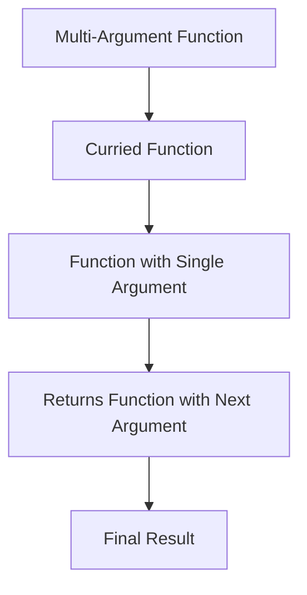

## 7.3. Currying Techniques

Currying is a fundamental concept in functional programming that enhances the flexibility and modularity of functions. In this section, we will delve into the definition and purpose of currying, explore its practical implementation across different functional programming languages, and provide visual aids and code snippets to solidify understanding.

### Definition and Purpose of Currying

Currying is the process of transforming a function that takes multiple arguments into a series of functions that each take a single argument. This transformation allows for partial application, where a function can be invoked with fewer arguments than it expects, returning a new function that takes the remaining arguments. Currying is named after the mathematician Haskell Curry, and it plays a crucial role in functional programming by enabling more flexible and reusable code.

#### Benefits of Currying

- **Partial Application:** Currying allows for the creation of specialized functions by fixing some arguments of a function and leaving the rest to be supplied later. This leads to more concise and expressive code.
- **Function Composition:** Curried functions can be easily composed with other functions, facilitating the creation of complex operations from simpler ones.
- **Enhanced Readability:** By breaking down functions into smaller, single-argument functions, currying can improve code readability and maintainability.

### Practical Implementation of Currying

Let's explore how currying can be implemented in various functional programming languages, showcasing its versatility and utility.

#### Haskell (Currying is Native)

In Haskell, functions are curried by default. This means that a function defined to take multiple arguments is inherently a series of functions, each taking a single argument.

```haskell
-- Define a function that adds two integers
add :: Int -> Int -> Int
add x y = x + y

-- Partially apply the function by fixing the first argument
addFive = add 5

-- Use the partially applied function
print (addFive 10) -- Output: 15
```

In this example, `add` is a curried function that takes two arguments. By applying `5` to `add`, we create a new function `addFive` that takes a single argument and adds `5` to it.

#### JavaScript (Using Ramda)

JavaScript does not natively support currying, but libraries like Ramda provide utilities to curry functions.

```javascript
const R = require('ramda');

// Define a function that adds two numbers
const add = (x, y) => x + y;

// Curry the function using Ramda
const addFive = R.curry(add)(5);

// Use the curried function
console.log(addFive(10)); // Output: 15
```

Here, we use Ramda's `curry` function to transform `add` into a curried function. By partially applying `5`, we create `addFive`, which can be used to add `5` to any number.

#### Scala

Scala supports currying through its syntax, allowing functions to be defined with multiple parameter lists.

```scala
// Define a curried function that adds two integers
def add(x: Int)(y: Int): Int = x + y

// Partially apply the function by fixing the first argument
val addFive = add(5) _

// Use the partially applied function
println(addFive(10)) // Output: 15
```

In Scala, the function `add` is defined with two parameter lists, making it a curried function. The underscore (`_`) is used to indicate partial application, creating `addFive`.

### Visual Aids

To better understand the transformation of a multi-argument function into a curried function, consider the following diagram:



This diagram illustrates how a function that initially takes multiple arguments is transformed into a series of functions, each taking a single argument, ultimately leading to the final result.

### Real-World Applications

Currying is widely used in functional programming to create more modular and reusable code. It is particularly useful in scenarios where functions need to be composed or partially applied to create specialized versions for specific tasks. For example, in web development, currying can be used to create middleware functions that handle specific types of requests by partially applying configuration parameters.

### Summary of Key Points

- Currying transforms a multi-argument function into a series of single-argument functions, facilitating partial application and function composition.
- It is natively supported in languages like Haskell and Scala, while libraries like Ramda enable currying in JavaScript.
- Currying enhances code modularity, readability, and reusability, making it a powerful tool in functional programming.

### Further Reading

For those interested in exploring currying further, consider the following resources:

- "Programming Elixir ≥ 1.6" by Dave Thomas
- "Functional Programming in Scala" by Paul Chiusano and Rúnar Bjarnason

## Quiz Time!



### What is currying in functional programming?

- [x] Transforming a function that takes multiple arguments into a series of functions that each take a single argument.
- [ ] Combining multiple functions into a single function.
- [ ] Converting a function to a recursive form.
- [ ] Optimizing a function for performance.

> **Explanation:** Currying involves transforming a multi-argument function into a series of single-argument functions, enabling partial application.

### Which language supports currying natively?

- [x] Haskell
- [ ] JavaScript
- [ ] Python
- [ ] C++

> **Explanation:** Haskell supports currying natively, allowing functions to be defined as a series of single-argument functions.

### How does currying enhance function flexibility?

- [x] By allowing partial application of functions.
- [ ] By increasing the number of arguments a function can take.
- [ ] By converting functions to iterative forms.
- [ ] By reducing the number of lines of code.

> **Explanation:** Currying allows for partial application, enabling functions to be called with fewer arguments and returning new functions for the remaining arguments.

### In JavaScript, which library is commonly used for currying?

- [x] Ramda
- [ ] Lodash
- [ ] jQuery
- [ ] D3.js

> **Explanation:** Ramda is a functional programming library in JavaScript that provides utilities for currying functions.

### What is the output of the following Haskell code: `addFive = add 5; print (addFive 10)`?

- [x] 15
- [ ] 5
- [ ] 10
- [ ] 20

> **Explanation:** The function `addFive` is a partially applied version of `add`, adding `5` to the argument `10`, resulting in `15`.

### In Scala, how is partial application indicated?

- [x] Using an underscore (`_`)
- [ ] Using a question mark (`?`)
- [ ] Using a dollar sign (`$`)
- [ ] Using a tilde (`~`)

> **Explanation:** In Scala, an underscore (`_`) is used to indicate partial application of a curried function.

### What is the purpose of currying in functional programming?

- [x] To enable partial application and enhance function composition.
- [ ] To increase the execution speed of functions.
- [ ] To convert functions to object-oriented methods.
- [ ] To simplify the syntax of functions.

> **Explanation:** Currying allows for partial application and enhances function composition, making code more modular and reusable.

### Which of the following is a benefit of currying?

- [x] Improved code readability
- [ ] Reduced memory usage
- [ ] Faster execution times
- [ ] Simplified error handling

> **Explanation:** Currying improves code readability by breaking down functions into smaller, single-argument functions.

### What is the main difference between currying and partial application?

- [x] Currying transforms a function into a series of single-argument functions, while partial application fixes some arguments of a function.
- [ ] Currying is used for optimization, while partial application is used for error handling.
- [ ] Currying is specific to Haskell, while partial application is specific to JavaScript.
- [ ] Currying and partial application are the same concepts.

> **Explanation:** Currying transforms a function into single-argument functions, while partial application involves fixing some arguments of a function.

### True or False: Currying is named after the mathematician Haskell Curry.

- [x] True
- [ ] False

> **Explanation:** Currying is indeed named after Haskell Curry, a mathematician who contributed to the development of this concept.


