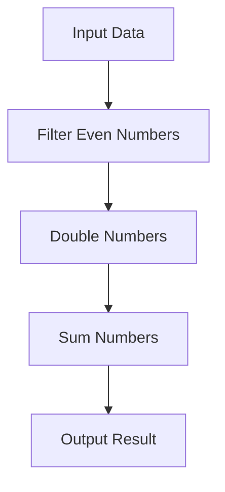

## 7.4. Building Complex Functions from Simple Ones

In functional programming, one of the most powerful techniques is the ability to build complex functions from simpler ones. This approach not only enhances modularity and maintainability but also aligns with the core principles of functional programming: immutability, pure functions, and higher-order functions. In this section, we will delve into the process of function composition, explore real-world applications, and provide practical examples in Haskell, JavaScript, and Scala.

### Step-by-Step Function Composition

Function composition is the process of combining two or more functions to produce a new function. This new function represents the application of each composed function in sequence. The essence of function composition is to create a pipeline where the output of one function becomes the input of the next.

#### The Basics of Function Composition

Let's start with a simple example to illustrate function composition. Suppose we have two functions:

- `addOne`: Increments a number by one.
- `multiplyByTwo`: Multiplies a number by two.

We can compose these functions to create a new function that first adds one to a number and then multiplies the result by two.

**Haskell Example:**

```haskell
let addOne = (+1)
let multiplyByTwo = (*2)
let combinedFunction = multiplyByTwo . addOne
print (combinedFunction 5) -- 12
```

In Haskell, the `.` operator is used for function composition. The `combinedFunction` first applies `addOne` and then `multiplyByTwo`.

**JavaScript Example:**

```javascript
const R = require('ramda');

const addOne = x => x + 1;
const multiplyByTwo = x => x * 2;
const combinedFunction = R.compose(multiplyByTwo, addOne);

console.log(combinedFunction(5)); // 12
```

In JavaScript, libraries like Ramda provide a `compose` function to achieve similar functionality.

**Scala Example:**

```scala
def addOne(x: Int): Int = x + 1
def multiplyByTwo(x: Int): Int = x * 2

val combinedFunction = multiplyByTwo _ compose addOne _
println(combinedFunction(5)) // 12
```

In Scala, the `compose` method is used to combine functions.

### Case Studies and Real-World Applications

Function composition is not just a theoretical concept; it has practical applications in real-world scenarios. Let's explore a few examples:

#### Case Study: Data Processing Pipeline

In data processing, it's common to have a series of transformations applied to data. Function composition allows us to build a pipeline of transformations that can be easily modified and extended.

Consider a scenario where we need to process a list of numbers by:

1. Filtering out odd numbers.
2. Doubling the remaining numbers.
3. Summing the results.

**Haskell Example:**

```haskell
let filterEven = filter even
let doubleNumbers = map (*2)
let sumNumbers = sum
let processNumbers = sumNumbers . doubleNumbers . filterEven
print (processNumbers [1, 2, 3, 4, 5]) -- 12
```

**JavaScript Example:**

```javascript
const R = require('ramda');

const filterEven = R.filter(x => x % 2 === 0);
const doubleNumbers = R.map(x => x * 2);
const sumNumbers = R.sum;
const processNumbers = R.compose(sumNumbers, doubleNumbers, filterEven);

console.log(processNumbers([1, 2, 3, 4, 5])); // 12
```

**Scala Example:**

```scala
val filterEven = (xs: List[Int]) => xs.filter(_ % 2 == 0)
val doubleNumbers = (xs: List[Int]) => xs.map(_ * 2)
val sumNumbers = (xs: List[Int]) => xs.sum

val processNumbers = sumNumbers _ compose doubleNumbers _ compose filterEven _
println(processNumbers(List(1, 2, 3, 4, 5))) // 12
```

### Visual Aids

To better understand function composition, let's visualize the process using a Mermaid.js diagram:



This diagram illustrates how data flows through each function in the composition, resulting in the final output.

### Building Complex Functions with Currying

Currying is another powerful concept in functional programming that allows us to transform a function with multiple arguments into a sequence of functions, each with a single argument. This technique is particularly useful when combined with function composition.

#### Example of Currying

Let's consider a function that calculates the volume of a rectangular prism:

**Haskell Example:**

```haskell
let volume = \l w h -> l * w * h
let curriedVolume = \l -> \w -> \h -> l * w * h
print ((curriedVolume 2) 3 4) -- 24
```

**JavaScript Example:**

```javascript
const volume = (l, w, h) => l * w * h;
const curriedVolume = l => w => h => l * w * h;

console.log(curriedVolume(2)(3)(4)); // 24
```

**Scala Example:**

```scala
def volume(l: Int, w: Int, h: Int): Int = l * w * h
def curriedVolume(l: Int)(w: Int)(h: Int): Int = l * w * h

println(curriedVolume(2)(3)(4)) // 24
```

### Real-World Application: Configurable Functions

Currying allows us to create configurable functions that can be partially applied. This is particularly useful in scenarios where certain parameters remain constant across multiple function calls.

**Example:**

Suppose we have a function that applies a discount to a price. We can curry this function to create a specific discount function:

**Haskell Example:**

```haskell
let applyDiscount = \rate price -> price - (price * rate)
let tenPercentDiscount = applyDiscount 0.10
print (tenPercentDiscount 100) -- 90
```

**JavaScript Example:**

```javascript
const applyDiscount = rate => price => price - (price * rate);
const tenPercentDiscount = applyDiscount(0.10);

console.log(tenPercentDiscount(100)); // 90
```

**Scala Example:**

```scala
def applyDiscount(rate: Double)(price: Double): Double = price - (price * rate)
val tenPercentDiscount = applyDiscount(0.10) _

println(tenPercentDiscount(100)) // 90
```

### Summary of Key Points

- **Function Composition** allows us to build complex functions by combining simpler ones, enhancing modularity and maintainability.
- **Currying** transforms functions with multiple arguments into a sequence of single-argument functions, enabling partial application and configurability.
- Real-world applications of these concepts include data processing pipelines and configurable functions.
- Visual aids, such as diagrams, can help illustrate the flow and transformation of data through composed functions.

### References

- "Purely Functional Data Structures" by Chris Okasaki.
- "Functional Programming in Scala" by Paul Chiusano and Rúnar Bjarnason.

## Quiz Time!



### What is function composition?

- [x] Combining two or more functions to produce a new function.
- [ ] Creating a function with multiple arguments.
- [ ] Transforming a function into a sequence of functions.
- [ ] Applying a function to a list of arguments.

> **Explanation:** Function composition involves combining functions to create a new function that applies each function in sequence.

### Which operator is used for function composition in Haskell?

- [x] .
- [ ] +
- [ ] *
- [ ] ->

> **Explanation:** In Haskell, the `.` operator is used for function composition.

### What is the result of the composed function `multiplyByTwo . addOne` when applied to 5 in Haskell?

- [x] 12
- [ ] 10
- [ ] 11
- [ ] 15

> **Explanation:** The function first adds one to 5, resulting in 6, and then multiplies by two, resulting in 12.

### How does currying transform a function?

- [x] It transforms a function with multiple arguments into a sequence of functions with single arguments.
- [ ] It combines multiple functions into one.
- [ ] It applies a function to a list of arguments.
- [ ] It creates a function with no arguments.

> **Explanation:** Currying transforms a function with multiple arguments into a sequence of single-argument functions.

### In JavaScript, which library provides a `compose` function for function composition?

- [x] Ramda
- [ ] Lodash
- [ ] Underscore
- [ ] jQuery

> **Explanation:** Ramda is a JavaScript library that provides a `compose` function for function composition.

### What is the primary benefit of using function composition?

- [x] Enhancing modularity and maintainability of code.
- [ ] Increasing the number of arguments a function can take.
- [ ] Reducing the number of functions in a program.
- [ ] Simplifying the syntax of functions.

> **Explanation:** Function composition enhances modularity and maintainability by allowing complex functions to be built from simpler ones.

### What does the curried function `curriedVolume(2)(3)(4)` return?

- [x] 24
- [ ] 20
- [ ] 12
- [ ] 30

> **Explanation:** The curried function calculates the volume of a rectangular prism with dimensions 2, 3, and 4, resulting in 24.

### Which of the following is a real-world application of function composition?

- [x] Data processing pipelines.
- [ ] Creating a user interface.
- [ ] Managing database connections.
- [ ] Designing network protocols.

> **Explanation:** Function composition is commonly used in data processing pipelines to apply a series of transformations to data.

### What is the purpose of currying in functional programming?

- [x] To enable partial application of functions.
- [ ] To increase the number of arguments a function can take.
- [ ] To simplify the syntax of functions.
- [ ] To reduce the number of functions in a program.

> **Explanation:** Currying enables partial application, allowing functions to be configured with some arguments fixed.

### True or False: Function composition can only be used in functional programming languages.

- [ ] True
- [x] False

> **Explanation:** Function composition can be used in any programming language that supports functions as first-class citizens, not just functional programming languages.


