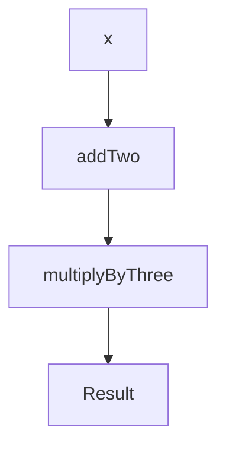

## 7.5. Practical Exercises

In this section, we will delve into practical exercises designed to reinforce your understanding of function composition and currying. These exercises will help you apply theoretical concepts to real-world scenarios, enhancing your functional programming skills. We will explore how to compose functions to solve complex problems and implement currying to refactor multi-argument functions. Let's get started!

### Composing Functions to Solve Problems

Function composition is a powerful technique that allows you to build complex operations by combining simpler functions. This approach promotes code reusability and clarity. In this exercise, you will compose functions to perform data transformations and calculations.

#### Exercise 1: Scala Function Composition

**Task:** Compose functions to calculate \\((x + 2) \times 3\\).

In this exercise, you will define two simple functions and compose them to achieve the desired calculation.

```scala
// Define a function to add two to a number
def addTwo(x: Int): Int = x + 2

// Define a function to multiply a number by three
def multiplyByThree(x: Int): Int = x * 3

// Compose the functions using the compose method
val calculate = multiplyByThree _ compose addTwo _

// Test the composed function
println(calculate(4)) // Output: 18
```

**Explanation:** The `compose` method in Scala allows you to combine two functions such that the output of the first function becomes the input of the second. Here, `addTwo` is applied first, followed by `multiplyByThree`.

#### Exercise 2: JavaScript Function Composition

**Task:** Use function composition to transform an array of numbers by first adding 1 to each element and then squaring the result.

```javascript
// Import Ramda library for functional utilities
const R = require('ramda');

// Define a function to add one to a number
const addOne = x => x + 1;

// Define a function to square a number
const square = x => x * x;

// Compose the functions using Ramda's compose function
const transform = R.compose(square, addOne);

// Apply the composed function to an array
const numbers = [1, 2, 3, 4];
const transformedNumbers = numbers.map(transform);

console.log(transformedNumbers); // Output: [4, 9, 16, 25]
```

**Explanation:** In JavaScript, libraries like Ramda provide a `compose` function that allows you to combine functions in a similar manner to Scala. Here, `addOne` is applied first, followed by `square`.

### Implementing Currying in Functional Code

Currying is the process of transforming a function with multiple arguments into a sequence of functions, each taking a single argument. This technique is useful for creating partially applied functions and enhancing code modularity.

#### Exercise 3: Scala Currying

**Task:** Refactor a multi-argument function into a curried function to calculate the volume of a cuboid.

```scala
// Define a curried function for calculating the volume
def volume(length: Double)(width: Double)(height: Double): Double = length * width * height

// Partially apply the function
val volumeWithLength5 = volume(5)_

// Calculate the volume with the remaining dimensions
val result = volumeWithLength5(3)(2)

println(result) // Output: 30.0
```

**Explanation:** In Scala, you can define curried functions by specifying multiple parameter lists. This allows you to partially apply the function, fixing some arguments while leaving others to be specified later.

#### Exercise 4: JavaScript Currying

**Task:** Implement a curried function for exponentiation using Ramda's `curry` function.

```javascript
// Import Ramda library for functional utilities
const R = require('ramda');

// Define a curried function for exponentiation
const exponentiate = R.curry((base, exponent) => Math.pow(base, exponent));

// Partially apply the function to create a square function
const square = exponentiate(2);

// Use the partially applied function
console.log(square(5)); // Output: 25
```

**Explanation:** In JavaScript, Ramda's `curry` function allows you to transform a regular function into a curried function. This enables partial application, where you can fix some arguments and create new functions.

### Visual Aids

To better understand the flow of data through composed and curried functions, let's visualize these processes using Mermaid.js diagrams.

#### Function Composition Diagram



**Explanation:** This diagram illustrates the flow of data through the composed functions `addTwo` and `multiplyByThree`. The input `x` is first processed by `addTwo`, and the result is then passed to `multiplyByThree`.

#### Currying and Partial Application Diagram

```mermaid
graph TD;
    A[volume(length)] --> B[volumeWithLength5(width)]
    B --> C[Result(height)]
```

**Explanation:** This diagram shows the process of currying and partial application. The `volume` function is curried, allowing partial application with `length`, resulting in `volumeWithLength5`, which can then be applied to `width` and `height`.

### References

- "Learning Functional Programming" by Richard Eisenberg.
- "Real World Haskell" by Bryan O'Sullivan, John Goerzen, and Don Stewart.

These references provide further insights into functional programming concepts and their applications.

## Quiz Time!



### What is the primary benefit of function composition in functional programming?

- [x] It allows building complex operations from simpler functions.
- [ ] It reduces the need for variables.
- [ ] It eliminates the need for loops.
- [ ] It automatically optimizes code performance.

> **Explanation:** Function composition enables the creation of complex operations by combining simpler functions, promoting code reusability and clarity.

### In Scala, which method is used to compose two functions?

- [ ] combine
- [x] compose
- [ ] merge
- [ ] link

> **Explanation:** The `compose` method in Scala is used to combine two functions, where the output of the first function is the input to the second.

### What does currying transform a multi-argument function into?

- [x] A sequence of functions, each taking a single argument.
- [ ] A single function with no arguments.
- [ ] A function that returns multiple values.
- [ ] A function that can only take one argument.

> **Explanation:** Currying transforms a multi-argument function into a sequence of functions, each taking a single argument, allowing for partial application.

### Which JavaScript library provides a `curry` function for currying?

- [ ] Lodash
- [ ] Underscore
- [x] Ramda
- [ ] jQuery

> **Explanation:** Ramda is a JavaScript library that provides a `curry` function to facilitate currying in functional programming.

### What is the output of the composed function in Exercise 1 (Scala) when input is 4?

- [ ] 12
- [x] 18
- [ ] 20
- [ ] 24

> **Explanation:** The composed function first adds 2 to the input (4), resulting in 6, and then multiplies by 3, resulting in 18.

### What is the purpose of partial application in currying?

- [x] To fix some arguments of a function and create a new function.
- [ ] To split a function into multiple smaller functions.
- [ ] To combine multiple functions into one.
- [ ] To eliminate the need for function arguments.

> **Explanation:** Partial application allows fixing some arguments of a function, creating a new function that can be called with the remaining arguments.

### In Exercise 2 (JavaScript), what is the output of the `transform` function when applied to the array `[1, 2, 3, 4]`?

- [ ] [2, 4, 6, 8]
- [ ] [1, 4, 9, 16]
- [x] [4, 9, 16, 25]
- [ ] [3, 6, 9, 12]

> **Explanation:** The `transform` function first adds 1 to each element and then squares the result, producing `[4, 9, 16, 25]`.

### How does the `compose` function in Ramda process functions?

- [x] Right to left
- [ ] Left to right
- [ ] Top to bottom
- [ ] Bottom to top

> **Explanation:** In Ramda, the `compose` function processes functions from right to left, meaning the rightmost function is applied first.

### What is the result of the curried `volume` function in Exercise 3 (Scala) when `length` is 5, `width` is 3, and `height` is 2?

- [ ] 15.0
- [ ] 20.0
- [x] 30.0
- [ ] 25.0

> **Explanation:** The curried `volume` function calculates the volume as `length * width * height`, resulting in `5 * 3 * 2 = 30.0`.

### True or False: Currying and partial application are the same concepts.

- [ ] True
- [x] False

> **Explanation:** Currying and partial application are related but distinct concepts. Currying transforms a function into a sequence of single-argument functions, while partial application involves fixing some arguments of a function to create a new function.



These exercises and quizzes are designed to solidify your understanding of function composition and currying, essential concepts in functional programming. By practicing these techniques, you'll be better equipped to write clean, modular, and reusable code.


