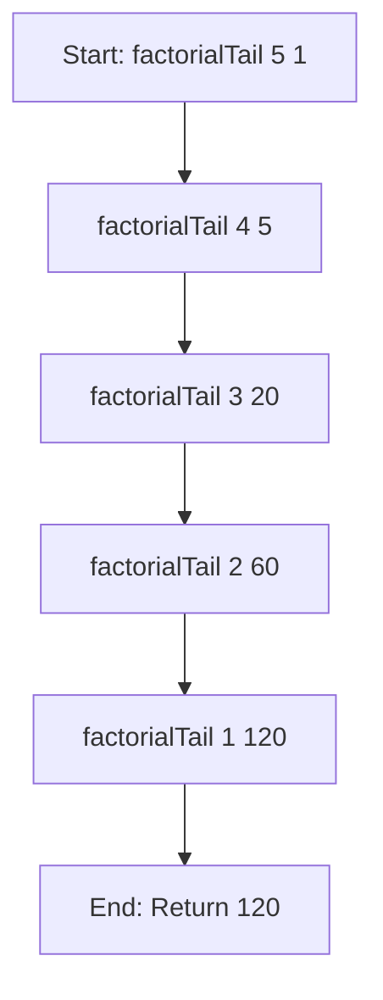
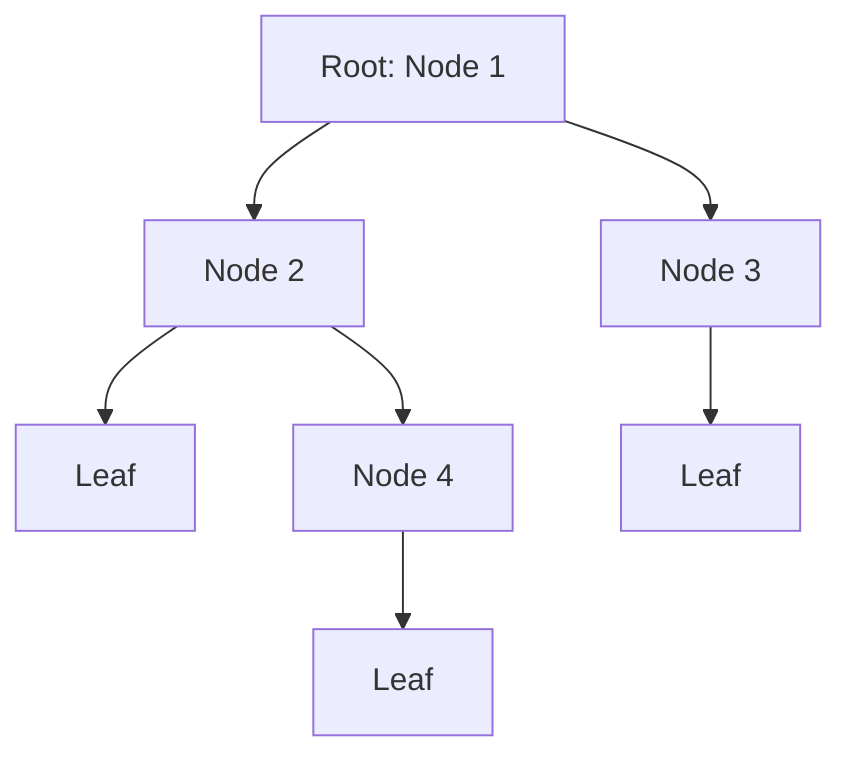

## 8.2. Common Recursive Patterns

Recursion is a fundamental concept in functional programming, allowing functions to call themselves to solve problems. This approach is particularly powerful for tasks involving repetitive or nested data structures. In this section, we will delve into common recursive patterns, focusing on tail recursion and tree traversal. These patterns are essential for writing efficient and elegant functional code.

### Tail Recursion

#### Understanding Tail Recursion

Tail recursion is a special form of recursion where the recursive call is the last operation in the function. This pattern allows the compiler or interpreter to optimize the recursive call, effectively transforming it into an iterative loop. This optimization, known as tail call optimization (TCO), prevents stack overflow errors and improves performance by reusing the current function's stack frame.

#### Benefits of Tail Recursion

- **Prevention of Stack Overflows:** By reusing the stack frame, tail recursion avoids the risk of stack overflow, which can occur in deep recursive calls.
- **Improved Performance:** Tail recursion can be optimized into a loop, reducing the overhead associated with function calls.
- **Memory Efficiency:** Since the stack frame is reused, memory usage is minimized, making tail recursion suitable for large input sizes.

#### Tail Recursion Example in Haskell

Let's explore a tail-recursive implementation of the factorial function in Haskell:

```haskell
factorialTail :: Int -> Int -> Int
factorialTail 0 acc = acc
factorialTail n acc = factorialTail (n - 1) (n * acc)

factorial = factorialTail 5 1 -- 120
```

In this example, `factorialTail` is a tail-recursive function where the recursive call to `factorialTail` is the last operation. The accumulator `acc` carries the result through each recursive step, allowing the function to be optimized by the Haskell compiler.

#### Visualizing Tail Recursion

Below is a diagram illustrating the process of tail recursion for calculating the factorial of a number:



### Tree and Graph Traversal

#### Recursive Techniques for Traversal

Trees and graphs are hierarchical data structures that naturally lend themselves to recursive processing. Recursive traversal involves visiting nodes in a specific order, such as depth-first or breadth-first.

#### Tree Traversal Example in Scala

Consider a simple tree structure in Scala, where each node can have multiple children:

```scala
sealed trait Tree
case class Node(value: Int, children: List[Tree]) extends Tree
case object Leaf extends Tree

def traverse(tree: Tree): List[Int] = tree match {
  case Leaf => List()
  case Node(value, children) => value :: children.flatMap(traverse)
}
```

In this example, the `traverse` function recursively visits each node in the tree, collecting values in a list. The use of pattern matching simplifies the traversal logic, making it easy to extend to more complex tree structures.

#### Visualizing Tree Traversal

The following diagram illustrates a simple tree traversal process:



In this diagram, the traversal visits nodes in a depth-first manner, processing each node's children before moving to the next sibling.

### Conclusion

Recursive patterns such as tail recursion and tree traversal are powerful tools in functional programming. Tail recursion offers performance benefits and prevents stack overflows, while recursive traversal provides a natural way to process hierarchical data structures. By mastering these patterns, you can write more efficient and elegant functional code.

### References

- "Functional Programming in Scala" by Paul Chiusano and Rúnar Bjarnason.
- "Functional Programming in JavaScript" by Luis Atencio.

## Quiz Time!



### What is tail recursion?

- [x] A form of recursion where the recursive call is the last operation in the function.
- [ ] A recursion pattern that uses multiple recursive calls.
- [ ] A recursion technique that does not use an accumulator.
- [ ] A recursion method that is not optimized by compilers.

> **Explanation:** Tail recursion is characterized by the recursive call being the last operation, allowing for optimization.

### What is the main benefit of tail recursion?

- [x] It prevents stack overflow by reusing the stack frame.
- [ ] It allows for multiple recursive calls.
- [ ] It increases the complexity of the function.
- [ ] It requires more memory than non-tail recursion.

> **Explanation:** Tail recursion reuses the stack frame, preventing stack overflow and improving performance.

### How does tail recursion improve performance?

- [x] By transforming the recursive call into an iterative loop.
- [ ] By increasing the number of recursive calls.
- [ ] By using more memory.
- [ ] By avoiding the use of an accumulator.

> **Explanation:** Tail recursion can be optimized into a loop, reducing the overhead of function calls.

### In the Haskell example, what is the role of the accumulator?

- [x] It carries the result through each recursive step.
- [ ] It increases the stack size.
- [ ] It decreases the number of recursive calls.
- [ ] It is not used in the function.

> **Explanation:** The accumulator holds the intermediate result, allowing the function to be tail-recursive.

### What is a common use case for recursive tree traversal?

- [x] Processing hierarchical data structures.
- [ ] Optimizing tail recursion.
- [ ] Increasing memory usage.
- [ ] Avoiding stack overflow.

> **Explanation:** Recursive tree traversal is ideal for processing hierarchical data structures like trees and graphs.

### In the Scala tree traversal example, what does the `flatMap` function do?

- [x] It applies the `traverse` function to each child and flattens the results.
- [ ] It increases the depth of the tree.
- [ ] It decreases the number of nodes.
- [ ] It optimizes the traversal process.

> **Explanation:** `flatMap` applies a function to each element and flattens the resulting lists into a single list.

### What type of traversal is demonstrated in the Scala example?

- [x] Depth-first traversal.
- [ ] Breadth-first traversal.
- [ ] Random traversal.
- [ ] Level-order traversal.

> **Explanation:** The Scala example demonstrates depth-first traversal, where each node's children are processed before moving to the next sibling.

### Which of the following is a benefit of using recursion for tree traversal?

- [x] Simplifies the logic for processing hierarchical data.
- [ ] Increases the complexity of the code.
- [ ] Requires more memory.
- [ ] Avoids the use of pattern matching.

> **Explanation:** Recursion simplifies the logic for processing hierarchical data structures like trees.

### What is the primary advantage of using pattern matching in recursive functions?

- [x] It simplifies the logic and makes the code more readable.
- [ ] It increases the number of recursive calls.
- [ ] It requires more memory.
- [ ] It avoids the use of accumulators.

> **Explanation:** Pattern matching simplifies the logic and enhances code readability, especially in recursive functions.

### True or False: Tail recursion can be optimized by the compiler to improve performance.

- [x] True
- [ ] False

> **Explanation:** Tail recursion can be optimized by the compiler into an iterative loop, improving performance and preventing stack overflow.


