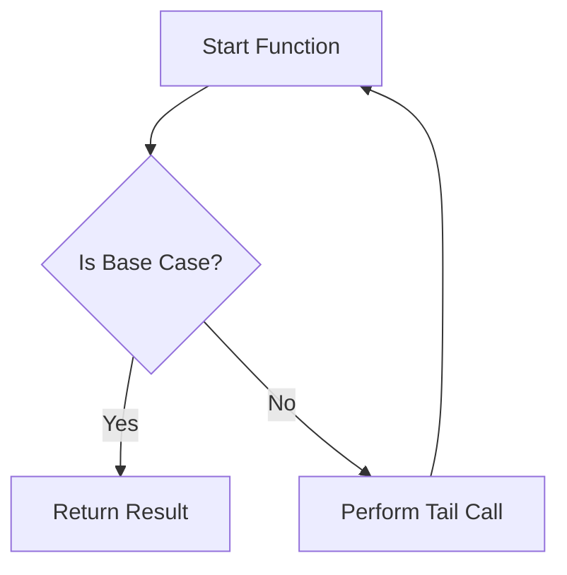

## 8.3. Tail Recursion Optimization

In the realm of functional programming, recursion is a fundamental concept that allows functions to call themselves to solve problems. However, traditional recursion can lead to stack overflow errors due to the accumulation of stack frames. Tail recursion optimization (TRO) is a powerful technique that addresses this issue, enhancing both the performance and reliability of recursive functions. In this section, we will delve into the mechanics of tail recursion optimization, explore its benefits, and provide practical examples in Haskell and Scala.

### Eliminating Stack Overflows

One of the primary challenges with recursive functions is the risk of stack overflow. Each recursive call typically adds a new frame to the call stack, and with deep recursion, this can exhaust the stack memory. Tail recursion optimization mitigates this by allowing the compiler or interpreter to reuse the current function's stack frame for the next call, effectively transforming the recursion into iteration.

#### How Tail Recursion Works

In a tail-recursive function, the recursive call is the last operation performed before the function returns. This means there is no need to keep the current stack frame active, as there are no further computations to perform after the recursive call. The compiler can optimize this by replacing the recursive call with a jump to the function's beginning, passing the updated parameters.

Here's a conceptual diagram illustrating the optimization process:



### Improving Performance with Tail Recursion

Tail recursion not only prevents stack overflows but also improves performance by reducing the overhead associated with function calls. By reusing the same stack frame, the function avoids the costly operations of pushing and popping frames from the call stack. This makes tail-recursive functions as efficient as their iterative counterparts.

#### Benefits of Tail Recursion

- **Memory Efficiency:** By reusing stack frames, tail recursion reduces memory usage, allowing functions to handle larger inputs without crashing.
- **Speed:** The elimination of stack operations leads to faster execution times.
- **Simplicity:** Tail-recursive functions maintain the elegance and clarity of recursive solutions while achieving the efficiency of iteration.

### Code Snippets

Let's explore tail recursion optimization with practical examples in Haskell and Scala.

#### Haskell Tail Recursive Factorial

In Haskell, we can implement a tail-recursive factorial function using an accumulator to carry the result through recursive calls:

```haskell
factorial :: Int -> Int
factorial n = go n 1
  where
    go 0 acc = acc
    go n acc = go (n - 1) (n * acc)
```

In this example, `go` is a helper function that performs the tail-recursive calls. The accumulator `acc` holds the intermediate results, and the recursion terminates when `n` reaches zero.

#### Scala Tail Recursive Function

Scala provides built-in support for tail recursion through the `@annotation.tailrec` annotation, which ensures that the function is optimized for tail recursion:

```scala
def factorial(n: Int): Int = {
  @annotation.tailrec
  def loop(x: Int, acc: Int): Int = {
    if (x == 0) acc
    else loop(x - 1, x * acc)
  }
  loop(n, 1)
}
```

The `loop` function in Scala works similarly to the Haskell example, using an accumulator to maintain the result. The `@annotation.tailrec` annotation instructs the compiler to optimize the function for tail recursion.

### Practical Exercises

To reinforce your understanding of tail recursion optimization, try implementing the following exercises:

1. **Convert a Recursive Function to Tail Recursion:**
   - Take a simple recursive function, such as calculating the Fibonacci sequence, and refactor it to use tail recursion.

2. **Analyze Performance:**
   - Compare the performance of a tail-recursive function with its non-tail-recursive counterpart using a large input size.

3. **Implement Tail Recursion in Different Languages:**
   - Try implementing a tail-recursive function in a language of your choice, such as JavaScript or Python, and explore how it handles recursion optimization.

### Summary of Key Points

- Tail recursion optimization is a technique that prevents stack overflows by reusing stack frames in recursive calls.
- It enhances performance by reducing the overhead of stack operations, making tail-recursive functions as efficient as iterative ones.
- Practical examples in Haskell and Scala demonstrate how to implement tail recursion, highlighting the use of accumulators and compiler optimizations.

### References and Further Reading

- "Scala for the Impatient" by Cay S. Horstmann.
- "Functional Programming in Scala" by Paul Chiusano and Rúnar Bjarnason.
- Explore the official Haskell and Scala documentation for more insights into recursion and optimization techniques.

## Quiz Time!



### What is the primary benefit of tail recursion optimization?

- [x] It prevents stack overflow by reusing stack frames.
- [ ] It increases the complexity of the code.
- [ ] It requires more memory than non-tail recursion.
- [ ] It makes the code harder to read.

> **Explanation:** Tail recursion optimization allows the compiler to reuse stack frames, preventing stack overflow and improving performance.

### How does tail recursion improve performance?

- [x] By reducing the overhead of stack operations.
- [ ] By increasing the number of recursive calls.
- [ ] By using more memory for each call.
- [ ] By making the code more complex.

> **Explanation:** Tail recursion reduces the overhead of stack operations by reusing stack frames, leading to faster execution.

### In a tail-recursive function, what is the last operation performed?

- [x] The recursive call.
- [ ] A computation after the recursive call.
- [ ] A return statement before the recursive call.
- [ ] An input validation check.

> **Explanation:** In a tail-recursive function, the recursive call is the last operation, allowing for optimization.

### Which annotation in Scala ensures a function is optimized for tail recursion?

- [x] @annotation.tailrec
- [ ] @tailrec
- [ ] @optimize
- [ ] @recursion

> **Explanation:** The `@annotation.tailrec` annotation in Scala ensures that a function is optimized for tail recursion.

### What is the role of an accumulator in a tail-recursive function?

- [x] To carry intermediate results through recursive calls.
- [ ] To increase the depth of recursion.
- [ ] To decrease the performance of the function.
- [ ] To make the function non-recursive.

> **Explanation:** An accumulator carries intermediate results, allowing the function to maintain state across recursive calls.

### Which of the following languages supports tail recursion optimization?

- [x] Haskell
- [x] Scala
- [ ] HTML
- [ ] CSS

> **Explanation:** Haskell and Scala both support tail recursion optimization, allowing efficient recursive function execution.

### What happens if a recursive call is not the last operation in a function?

- [ ] The function is optimized for tail recursion.
- [x] The function may not be optimized for tail recursion.
- [ ] The function will always cause a stack overflow.
- [ ] The function will not compile.

> **Explanation:** If the recursive call is not the last operation, the function may not be optimized for tail recursion, leading to potential stack overflow.

### Which of the following is a common use case for tail recursion?

- [x] Calculating factorials.
- [ ] Styling web pages.
- [ ] Writing SQL queries.
- [ ] Designing user interfaces.

> **Explanation:** Tail recursion is commonly used in mathematical computations like calculating factorials.

### What is the main difference between tail recursion and non-tail recursion?

- [x] Tail recursion allows for stack frame reuse.
- [ ] Non-tail recursion is always faster.
- [ ] Tail recursion uses more memory.
- [ ] Non-tail recursion is easier to read.

> **Explanation:** Tail recursion allows for stack frame reuse, preventing stack overflow and improving performance.

### True or False: Tail recursion can be as efficient as iteration.

- [x] True
- [ ] False

> **Explanation:** Tail recursion can be optimized to be as efficient as iteration by reusing stack frames.


