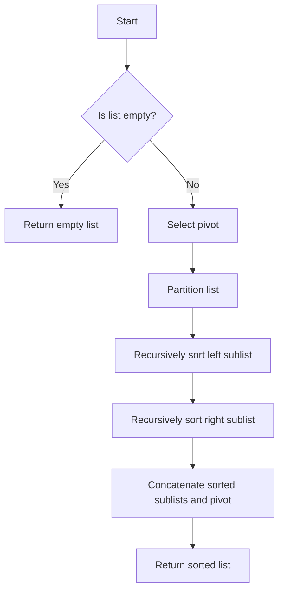

---

linkTitle: "8.4. Practical Applications of Recursion"
title: "Practical Applications of Recursion in Functional Programming"
description: "Explore practical applications of recursion in solving mathematical problems and implementing data processing algorithms like quicksort, mergesort, and binary search."
categories:
- Functional Programming
- Algorithms
- Recursion
tags:
- Recursion
- Functional Programming
- Algorithms
- Haskell
- JavaScript
- Scala
date: 2024-10-25
type: docs
nav_weight: 8400

---

## 8.4. Practical Applications of Recursion

Recursion is a fundamental concept in functional programming, offering elegant solutions to complex problems by breaking them down into simpler, self-referential components. In this section, we will explore how recursion can be applied to solve mathematical problems and implement efficient data processing algorithms. By understanding these applications, you will gain insight into the power and versatility of recursion in functional programming.

### Solving Mathematical Problems Recursively

Recursion is particularly well-suited for solving mathematical problems that can be defined in terms of smaller subproblems. Here are some classic examples:

#### Factorial

The factorial of a non-negative integer \\( n \\) is the product of all positive integers less than or equal to \\( n \\). It is denoted by \\( n! \\) and can be defined recursively as follows:

- Base case: \\( 0! = 1 \\)
- Recursive case: \\( n! = n \times (n-1)! \\)

Here's how you can implement the factorial function in Haskell:

```haskell
factorial :: Integer -> Integer
factorial 0 = 1
factorial n = n * factorial (n - 1)
```

#### Fibonacci Sequence

The Fibonacci sequence is a series of numbers where each number is the sum of the two preceding ones, starting from 0 and 1. It can be defined recursively as:

- Base cases: \\( F(0) = 0 \\), \\( F(1) = 1 \\)
- Recursive case: \\( F(n) = F(n-1) + F(n-2) \\)

Here's a simple implementation in JavaScript:

```javascript
const fibonacci = (n) => {
  if (n <= 1) return n;
  return fibonacci(n - 1) + fibonacci(n - 2);
};

console.log(fibonacci(5)); // Output: 5
```

#### Greatest Common Divisor (GCD)

The GCD of two integers is the largest integer that divides both without leaving a remainder. The Euclidean algorithm provides a recursive method to compute the GCD:

- Base case: \\( \text{gcd}(a, 0) = a \\)
- Recursive case: \\( \text{gcd}(a, b) = \text{gcd}(b, a \mod b) \\)

Here's how you can implement it in Scala:

```scala
def gcd(a: Int, b: Int): Int = {
  if (b == 0) a else gcd(b, a % b)
}

println(gcd(48, 18)) // Output: 6
```

### Recursive Algorithms in Data Processing

Recursion is also a powerful tool for implementing algorithms that process data. Let's explore some common recursive algorithms used in data processing:

#### Quicksort

Quicksort is a popular sorting algorithm that uses a divide-and-conquer strategy. It works by selecting a 'pivot' element and partitioning the array into two sub-arrays: elements less than the pivot and elements greater than the pivot. The process is then recursively applied to the sub-arrays.

Here's a Haskell implementation of quicksort:

```haskell
quicksort :: (Ord a) => [a] -> [a]
quicksort [] = []
quicksort (x:xs) = quicksort [y | y <- xs, y < x]
                  ++ [x]
                  ++ quicksort [y | y <- xs, y >= x]
```

#### Mergesort

Mergesort is another divide-and-conquer algorithm that divides the array into two halves, recursively sorts them, and then merges the sorted halves. It is known for its stable sorting and \\( O(n \log n) \\) time complexity.

Here's a JavaScript implementation of mergesort:

```javascript
const merge = (left, right) => {
  let result = [];
  while (left.length && right.length) {
    if (left[0] < right[0]) {
      result.push(left.shift());
    } else {
      result.push(right.shift());
    }
  }
  return result.concat(left, right);
};

const mergesort = (arr) => {
  if (arr.length <= 1) return arr;
  const mid = Math.floor(arr.length / 2);
  const left = mergesort(arr.slice(0, mid));
  const right = mergesort(arr.slice(mid));
  return merge(left, right);
};

console.log(mergesort([5, 3, 8, 4, 2])); // [2, 3, 4, 5, 8]
```

#### Binary Search

Binary search is an efficient algorithm for finding an item from a sorted list of items. It works by repeatedly dividing the search interval in half. If the value of the search key is less than the item in the middle of the interval, narrow the interval to the lower half. Otherwise, narrow it to the upper half.

Here's a Scala implementation of binary search:

```scala
def binarySearch(arr: Array[Int], target: Int): Boolean = {
  def search(low: Int, high: Int): Boolean = {
    if (low > high) false
    else {
      val mid = low + (high - low) / 2
      if (arr(mid) == target) true
      else if (arr(mid) < target) search(mid + 1, high)
      else search(low, mid - 1)
    }
  }
  search(0, arr.length - 1)
}

println(binarySearch(Array(1, 3, 5, 7, 9), 5)) // true
println(binarySearch(Array(1, 3, 5, 7, 9), 4)) // false
```

### Visual Aids

To better understand how recursive algorithms work, let's visualize the quicksort algorithm using a flowchart:



This flowchart illustrates the recursive nature of quicksort, showing how the list is divided and conquered step by step.

### Practical Exercises

1. **Implement Factorial in Your Favorite Language:**
   - Write a recursive function to calculate the factorial of a number in a language of your choice.

2. **Fibonacci Sequence Optimization:**
   - Implement the Fibonacci sequence using memoization to improve performance.

3. **Quicksort Implementation:**
   - Implement the quicksort algorithm in a language you are learning and test it with different datasets.

4. **Binary Search Practice:**
   - Implement a binary search function and test it with various sorted arrays and target values.

### Summary of Key Points

- Recursion is a powerful tool for solving mathematical problems and implementing data processing algorithms.
- Recursive solutions often provide elegant and concise implementations for problems like factorial, Fibonacci, and GCD.
- Algorithms like quicksort, mergesort, and binary search leverage recursion to efficiently process data.
- Visual aids such as flowcharts can help in understanding the recursive flow of algorithms.

### References

- "Introduction to Algorithms" by Thomas H. Cormen, Charles E. Leiserson, Ronald L. Rivest, and Clifford Stein.
- "Functional Programming in Swift" by Chris Eidhof, Florian Kugler, and Wouter Swierstra.

## Quiz Time!



### What is the base case for the factorial function?

- [x] 0! = 1
- [ ] 1! = 0
- [ ] n! = n * (n-1)!
- [ ] n! = n + (n-1)!

> **Explanation:** The base case for the factorial function is 0! = 1, which stops the recursion.

### How is the Fibonacci sequence defined recursively?

- [x] F(n) = F(n-1) + F(n-2)
- [ ] F(n) = F(n-1) * F(n-2)
- [ ] F(n) = F(n+1) - F(n-2)
- [ ] F(n) = F(n-1) - F(n-2)

> **Explanation:** The Fibonacci sequence is defined recursively as F(n) = F(n-1) + F(n-2).

### What is the time complexity of mergesort?

- [x] O(n log n)
- [ ] O(n^2)
- [ ] O(log n)
- [ ] O(n)

> **Explanation:** Mergesort has a time complexity of O(n log n) due to its divide-and-conquer approach.

### What is the purpose of the pivot in quicksort?

- [x] To partition the array into elements less than and greater than the pivot
- [ ] To find the median of the array
- [ ] To sort the array in place
- [ ] To reverse the array

> **Explanation:** The pivot is used to partition the array into elements less than and greater than itself.

### How does binary search achieve its efficiency?

- [x] By dividing the search interval in half each time
- [ ] By checking each element sequentially
- [ ] By sorting the array first
- [ ] By using a pivot element

> **Explanation:** Binary search achieves efficiency by dividing the search interval in half each time.

### What is the base case for the GCD function using the Euclidean algorithm?

- [x] gcd(a, 0) = a
- [ ] gcd(a, a) = 0
- [ ] gcd(a, b) = b
- [ ] gcd(a, b) = a + b

> **Explanation:** The base case for the GCD function is gcd(a, 0) = a, which stops the recursion.

### Which algorithm is known for its stable sorting?

- [x] Mergesort
- [ ] Quicksort
- [ ] Binary search
- [ ] Bubble sort

> **Explanation:** Mergesort is known for its stable sorting, meaning it maintains the relative order of equal elements.

### What is a common optimization technique for the Fibonacci sequence?

- [x] Memoization
- [ ] Sorting
- [ ] Using a pivot
- [ ] Binary search

> **Explanation:** Memoization is a common optimization technique for the Fibonacci sequence to avoid redundant calculations.

### In which scenario is recursion particularly useful?

- [x] When a problem can be divided into smaller subproblems
- [ ] When a problem requires iterative loops
- [ ] When a problem involves complex data structures
- [ ] When a problem needs constant time complexity

> **Explanation:** Recursion is particularly useful when a problem can be divided into smaller subproblems.

### True or False: Quicksort is a recursive algorithm.

- [x] True
- [ ] False

> **Explanation:** Quicksort is a recursive algorithm that uses a divide-and-conquer approach to sort elements.




