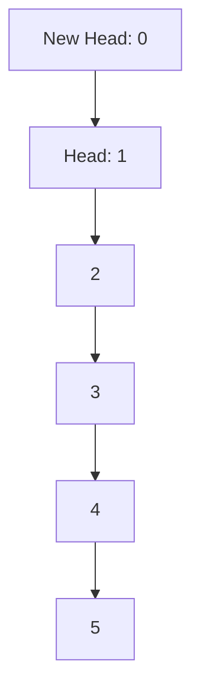

---

linkTitle: "9.1. Lists and Linked Structures"
title: "Immutable Lists and Linked Structures in Functional Programming"
description: "Explore the fundamentals of immutable lists and linked structures in functional programming, including common operations and practical examples in Haskell, JavaScript, and Scala."
categories:
- Functional Programming
- Data Structures
- Programming Languages
tags:
- Immutable Lists
- Functional Programming
- Haskell
- JavaScript
- Scala
date: 2024-10-25
type: docs
nav_weight: 9100

---

## 9.1. Lists and Linked Structures

In the realm of functional programming, lists and linked structures are foundational elements that embody the principles of immutability and functional purity. Understanding these structures is crucial for anyone looking to master functional programming. This section delves into the concept of immutable lists, explores common operations, and provides practical examples across multiple functional programming languages.

### Immutable Lists

Immutable lists are a cornerstone of functional programming. Unlike mutable data structures, immutable lists cannot be altered once they are created. This immutability offers several advantages, such as simplifying reasoning about code, avoiding side effects, and enhancing concurrency safety. In functional programming, lists are often used to represent sequences of elements, and their immutable nature ensures that operations on these lists do not inadvertently affect other parts of the program.

#### Benefits of Immutable Lists

- **Predictability:** Since immutable lists cannot change, they provide a predictable behavior, making it easier to understand and debug code.
- **Thread Safety:** Immutability eliminates the need for locks or other synchronization mechanisms in concurrent programming, as there are no changes to the data structure that could lead to race conditions.
- **Ease of Reasoning:** With immutable data, you can reason about the state of your program at any point in time without worrying about unexpected modifications.

### Operations on Lists

Functional programming languages provide a variety of operations to manipulate lists. Some of the most common operations include:

- **Head:** Retrieves the first element of the list.
- **Tail:** Returns a new list containing all elements except the first.
- **Cons:** Constructs a new list by adding an element to the front of an existing list.

Let's explore these operations with examples in Haskell, JavaScript (using Immutable.js), and Scala.

#### Haskell

```haskell
let myList = [1, 2, 3, 4, 5]
let firstElement = head myList -- 1
let remaining = tail myList -- [2, 3, 4, 5]
let newList = 0 : myList -- [0, 1, 2, 3, 4, 5]
```

In Haskell, lists are a fundamental data type, and operations like `head`, `tail`, and `cons` (using the `:` operator) are built-in.

#### JavaScript (Using Immutable.js)

```javascript
const { List } = require('immutable');

const myList = List([1, 2, 3, 4, 5]);
const firstElement = myList.first(); // 1
const remaining = myList.shift(); // List [2, 3, 4, 5]
const newList = myList.unshift(0); // List [0, 1, 2, 3, 4, 5]
```

JavaScript, being a multi-paradigm language, requires libraries like Immutable.js to work with immutable data structures. The library provides methods analogous to `head`, `tail`, and `cons`.

#### Scala

```scala
val myList = List(1, 2, 3, 4, 5)
val firstElement = myList.head // 1
val remaining = myList.tail // List(2, 3, 4, 5)
val newList = 0 :: myList // List(0, 1, 2, 3, 4, 5)
```

In Scala, lists are immutable by default, and operations like `head`, `tail`, and `cons` (using the `::` operator) are straightforward and idiomatic.

### Visual Aids

To better understand the structure and operations of immutable lists, let's visualize these concepts using a Mermaid.js diagram.



This diagram illustrates a simple linked list structure, where each node points to the next, and the `cons` operation adds a new head to the list.

### Practical Exercises

To reinforce your understanding of immutable lists and their operations, try the following exercises:

1. **Exercise 1:** Implement a function in Haskell that takes a list and returns a new list with each element doubled.
2. **Exercise 2:** Using Immutable.js in JavaScript, create a function that removes the last element from a list.
3. **Exercise 3:** In Scala, write a function that concatenates two lists without using built-in methods.

### Real-World Applications

Immutable lists are widely used in real-world applications, particularly in scenarios where data integrity and consistency are paramount. For example, in financial systems, immutable lists can be used to track transactions, ensuring that once a transaction is recorded, it cannot be altered.

### Summary of Key Points

- Immutable lists are a fundamental data structure in functional programming, offering predictability, thread safety, and ease of reasoning.
- Common operations on lists include `head`, `tail`, and `cons`, which are supported across various functional programming languages.
- Understanding and utilizing immutable lists can lead to more robust and maintainable code.

### References

- "Purely Functional Data Structures" by Chris Okasaki.
- "Programming in Haskell" by Graham Hutton.

## Quiz Time!



### What is an immutable list?

- [x] A list that cannot be changed after it is created.
- [ ] A list that can be modified at any time.
- [ ] A list that automatically updates its elements.
- [ ] A list that is only used in object-oriented programming.

> **Explanation:** An immutable list is a data structure that, once created, cannot be altered. This immutability is a key feature in functional programming.

### Which operation retrieves the first element of a list?

- [x] Head
- [ ] Tail
- [ ] Cons
- [ ] Append

> **Explanation:** The `head` operation is used to retrieve the first element of a list in functional programming.

### In Haskell, what does the `:` operator do?

- [x] It constructs a new list by adding an element to the front.
- [ ] It removes the first element of a list.
- [ ] It concatenates two lists.
- [ ] It reverses a list.

> **Explanation:** In Haskell, the `:` operator is used to add an element to the front of a list, effectively constructing a new list.

### How does Immutable.js in JavaScript handle immutability?

- [x] By providing immutable data structures and methods.
- [ ] By using JavaScript's built-in mutable arrays.
- [ ] By converting lists to strings.
- [ ] By using global variables.

> **Explanation:** Immutable.js provides immutable data structures and methods to work with them, ensuring that data cannot be changed after creation.

### What is the result of `tail` operation on a list?

- [x] A new list with all elements except the first.
- [ ] The first element of the list.
- [ ] The last element of the list.
- [ ] An empty list.

> **Explanation:** The `tail` operation returns a new list containing all elements except the first one.

### Which of the following is a benefit of immutable lists?

- [x] Thread safety
- [ ] Increased memory usage
- [ ] Slower performance
- [ ] Complexity in code

> **Explanation:** Immutable lists provide thread safety because they cannot be changed, eliminating the risk of race conditions in concurrent environments.

### In Scala, which operator is used for the `cons` operation?

- [x] ::
- [ ] ++
- [ ] --
- [ ] **

> **Explanation:** In Scala, the `::` operator is used for the `cons` operation, which adds an element to the front of a list.

### What is a common use case for immutable lists in real-world applications?

- [x] Tracking transactions in financial systems
- [ ] Storing temporary data
- [ ] Managing user sessions
- [ ] Caching frequently accessed data

> **Explanation:** Immutable lists are often used in financial systems to track transactions, ensuring data integrity and consistency.

### Which language requires a library to work with immutable lists?

- [x] JavaScript
- [ ] Haskell
- [ ] Scala
- [ ] F#

> **Explanation:** JavaScript requires libraries like Immutable.js to work with immutable lists, as it is not inherently a functional programming language.

### True or False: Immutable lists can be modified after creation.

- [ ] True
- [x] False

> **Explanation:** False. Immutable lists cannot be modified after they are created, which is a defining characteristic of immutability.


