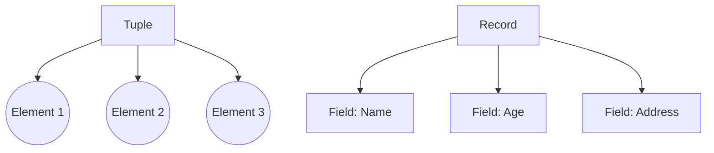

## 9.2. Tuples and Records

In the realm of functional programming, understanding and effectively utilizing data structures is crucial for building robust and maintainable applications. Two fundamental data structures that often come into play are tuples and records. This section delves into their definitions, usage, and implementation across various functional programming languages, providing a solid foundation for leveraging these constructs in your projects.

### Definition and Usage of Tuples

Tuples are fixed-size, ordered collections of elements that can hold different types. They are particularly useful for grouping related data without the need for defining separate data structures. Unlike lists or arrays, tuples are immutable, meaning their contents cannot be changed once created. This immutability aligns well with the principles of functional programming, promoting data integrity and predictability.

#### Characteristics of Tuples:
- **Fixed Size:** The number of elements in a tuple is determined at the time of its creation and cannot be altered.
- **Ordered:** Elements in a tuple are ordered, and each element can be accessed by its position.
- **Heterogeneous:** Tuples can contain elements of different types, making them versatile for various use cases.

#### Common Use Cases:
- **Returning Multiple Values:** Functions can return multiple values encapsulated in a tuple, providing a convenient way to handle multiple outputs.
- **Grouping Related Data:** Tuples can group related data without the overhead of defining a full-fledged data structure.

### Immutable Records and Their Applications

Immutable records, also known as structs or objects in some languages, are data structures with named fields. They enhance type safety and readability by providing a clear structure for data. Unlike tuples, which are accessed by position, records are accessed by field names, making the code more self-documenting and easier to understand.

#### Characteristics of Immutable Records:
- **Named Fields:** Each piece of data in a record is associated with a field name, improving code clarity.
- **Immutability:** Once created, the contents of a record cannot be changed, ensuring data consistency.
- **Type Safety:** Records often come with type annotations, providing compile-time checks and reducing runtime errors.

#### Common Use Cases:
- **Modeling Complex Data:** Records are ideal for modeling complex data structures where each element has a specific role.
- **Enhancing Readability:** By using named fields, records make the code more readable and maintainable.

### Visual Aids

To better understand the structure of tuples and records, consider the following diagram illustrating their differences:



In this diagram, the tuple is represented as a simple collection of elements, while the record is shown with named fields, highlighting the structural differences.

### Code Snippets

Let's explore how tuples and records are implemented in different functional programming languages.

#### Haskell Tuple Example

In Haskell, tuples are a fundamental part of the language, allowing for easy grouping of data:

```haskell
type Person = (String, Int)
let john = ("John Doe", 30)
let (name, age) = john
-- name is "John Doe", age is 30
```

Here, a `Person` is defined as a tuple containing a `String` and an `Int`. The tuple `john` holds a name and an age, which are accessed by pattern matching.

#### JavaScript (Using Immutable.js Records)

JavaScript, with the help of libraries like Immutable.js, can mimic the behavior of records:

```javascript
const { Record } = require('immutable');

const Person = Record({ name: '', age: 0 });
const john = new Person({ name: 'John Doe', age: 30 });
const name = john.get('name'); // "John Doe"
const age = john.get('age'); // 30
```

In this example, `Person` is defined as an immutable record with fields `name` and `age`. The `john` instance is created with specific values, and fields are accessed using the `get` method.

#### Scala Case Class Example

Scala provides a powerful feature called case classes, which are ideal for defining immutable records:

```scala
case class Person(name: String, age: Int)
val john = Person("John Doe", 30)
val name = john.name // "John Doe"
val age = john.age // 30
```

In Scala, `Person` is a case class with named fields `name` and `age`. Instances of case classes are immutable by default, and fields are accessed directly.

### Practical Exercises

To reinforce your understanding of tuples and records, try the following exercises:

1. **Haskell Exercise:** Define a tuple representing a book with a title, author, and publication year. Write a function that extracts and prints each element.

2. **JavaScript Exercise:** Using Immutable.js, create a record for a car with fields for make, model, and year. Write a function to update the year and return a new record.

3. **Scala Exercise:** Define a case class for a student with fields for name, age, and grade. Write a method to increment the student's grade and return a new instance.

### Summary of Key Points

- **Tuples** are fixed-size, ordered collections that can hold elements of different types, useful for grouping related data.
- **Immutable Records** provide named fields, enhancing readability and type safety, and are ideal for modeling complex data structures.
- Different languages offer various ways to implement these structures, each with its idiomatic approach.

### References

- "Programming in Haskell" by Graham Hutton.
- "Scala for the Impatient" by Cay S. Horstmann.

### Further Reading

- Explore the official documentation for [Haskell](https://www.haskell.org/documentation/) and [Scala](https://docs.scala-lang.org/) to deepen your understanding of tuples and records.
- Check out [Immutable.js](https://immutable-js.github.io/immutable-js/) for more on immutable data structures in JavaScript.

## Quiz Time!



### What is a tuple in functional programming?

- [x] A fixed-size, ordered collection of elements that can hold different types
- [ ] A mutable collection of elements
- [ ] A data structure with named fields
- [ ] A type of loop used in functional programming

> **Explanation:** Tuples are fixed-size, ordered collections that can hold elements of different types, making them useful for grouping related data.

### How are tuples accessed in Haskell?

- [x] By pattern matching
- [ ] By field names
- [ ] By index
- [ ] By using a loop

> **Explanation:** In Haskell, tuples are accessed by pattern matching, allowing you to extract elements by their position.

### What is an immutable record?

- [x] A data structure with named fields that cannot be changed once created
- [ ] A mutable data structure with named fields
- [ ] A collection of elements accessed by index
- [ ] A type of loop used in functional programming

> **Explanation:** Immutable records are data structures with named fields that remain unchanged once created, enhancing data integrity.

### How do you access fields in a JavaScript Immutable.js record?

- [x] Using the `get` method
- [ ] Using the `set` method
- [ ] By index
- [ ] By pattern matching

> **Explanation:** In Immutable.js, fields in a record are accessed using the `get` method, which retrieves the value associated with a field name.

### What is a common use case for tuples?

- [x] Returning multiple values from a function
- [ ] Storing a large collection of data
- [ ] Iterating over a list
- [ ] Performing arithmetic operations

> **Explanation:** Tuples are commonly used to return multiple values from a function, allowing for convenient handling of multiple outputs.

### In Scala, what feature is used to define immutable records?

- [x] Case classes
- [ ] Arrays
- [ ] Lists
- [ ] Loops

> **Explanation:** Scala uses case classes to define immutable records, providing named fields and immutability by default.

### What is a key benefit of using immutable records?

- [x] Enhanced readability and type safety
- [ ] Increased mutability
- [ ] Faster execution time
- [ ] Simplified syntax

> **Explanation:** Immutable records enhance readability and type safety by providing a clear structure with named fields.

### How do tuples differ from records?

- [x] Tuples are accessed by position, while records are accessed by field names
- [ ] Tuples are mutable, while records are immutable
- [ ] Tuples can only hold elements of the same type
- [ ] Tuples are larger than records

> **Explanation:** Tuples are accessed by position, whereas records are accessed by field names, making records more readable.

### Which language feature in Haskell allows for easy extraction of tuple elements?

- [x] Pattern matching
- [ ] Loops
- [ ] Indexing
- [ ] Field names

> **Explanation:** Pattern matching in Haskell allows for easy extraction of tuple elements by their position.

### True or False: In functional programming, tuples and records are always mutable.

- [ ] True
- [x] False

> **Explanation:** In functional programming, tuples and records are typically immutable, promoting data integrity and predictability.


