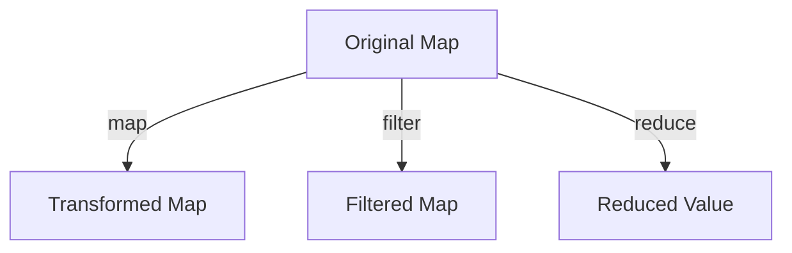

## 9.3. Maps and Dictionaries

In functional programming, data structures are often immutable, meaning they cannot be changed after they are created. This immutability is a cornerstone of functional programming, providing benefits such as easier reasoning about code, avoidance of side effects, and enhanced concurrency. In this section, we will explore maps and dictionaries, which are key-value pair data structures, and how they are implemented and manipulated in a functional programming context.

### Implementing Immutable Maps

Immutable maps are collections of key-value pairs where the data cannot be altered once the map is created. Instead of modifying the map directly, operations on immutable maps return a new map with the desired changes. This approach ensures data integrity and consistency throughout the program.

#### Key Characteristics of Immutable Maps

- **Immutability:** Once a map is created, it cannot be changed. Any operation that seems to modify the map actually returns a new map.
- **Persistence:** Immutable maps often share structure between versions to optimize performance and memory usage.
- **Thread-Safety:** Due to their immutable nature, these maps are inherently thread-safe, making them ideal for concurrent programming.

### Functional Operations on Maps

Functional programming languages provide powerful operations to manipulate maps in a declarative manner. Common operations include `map`, `filter`, and `reduce`, which allow for expressive data transformations.

#### Map Operation

The `map` operation applies a function to each value in the map, producing a new map with the transformed values.

#### Filter Operation

The `filter` operation creates a new map containing only the key-value pairs that satisfy a given predicate function.

#### Reduce Operation

The `reduce` operation aggregates the values in the map using a specified combining function, resulting in a single accumulated value.

### Visual Aids

Below is a Mermaid.js diagram illustrating the transformation of a map through functional operations:



### Code Snippets

Let's explore how these concepts are implemented in different functional programming languages.

#### Haskell

In Haskell, the `Data.Map` module provides a robust implementation of maps.

```haskell
import qualified Data.Map as Map

-- Creating an immutable map
let myMap = Map.fromList [(1, "one"), (2, "two")]

-- Adding a new key-value pair
let updatedMap = Map.insert 3 "three" myMap

-- Filtering the map
let filteredMap = Map.filter (\v -> length v > 3) myMap -- Result: {(2, "two")}
```

#### JavaScript (Using Immutable.js)

JavaScript, with the help of libraries like Immutable.js, can also handle immutable data structures.

```javascript
const { Map } = require('immutable');

// Creating an immutable map
const myMap = Map({ 1: "one", 2: "two" });

// Adding a new key-value pair
const updatedMap = myMap.set(3, "three");

// Filtering the map
const filteredMap = myMap.filter(v => v.length > 3); // Result: Map { 2: "two" }
```

#### Scala

Scala's standard library provides immutable maps by default.

```scala
val myMap = Map(1 -> "one", 2 -> "two")

// Adding a new key-value pair
val updatedMap = myMap + (3 -> "three")

// Filtering the map
val filteredMap = myMap.filter { case (_, v) => v.length > 3 } // Result: Map.empty
```

### Practical Exercises

To reinforce your understanding, try implementing the following exercises:

1. **Exercise 1:** Create an immutable map in your preferred language and perform a series of operations: add a new key-value pair, update an existing value, and remove a key.
2. **Exercise 2:** Use the `filter` operation to extract a subset of the map based on a specific condition.
3. **Exercise 3:** Implement a `reduce` operation to calculate the total length of all values in the map.

### Real-World Applications

Immutable maps are widely used in real-world applications, especially in scenarios requiring concurrent data access and manipulation. They are commonly found in:

- **Configuration Management:** Storing application settings that should not change during runtime.
- **Caching Systems:** Maintaining read-only caches that can be safely accessed by multiple threads.
- **Functional Reactive Programming (FRP):** Managing state in reactive systems where immutability ensures consistency.

### Summary of Key Points

- Immutable maps provide a reliable way to manage key-value pairs without side effects.
- Functional operations like `map`, `filter`, and `reduce` enable expressive and concise data transformations.
- Different functional programming languages offer various implementations and libraries to work with immutable maps.

### References

- "Functional Programming in Scala" by Paul Chiusano and Rúnar Bjarnason.
- "JavaScript Patterns" by Stoyan Stefanov.

### Further Reading

- Explore the official documentation for Haskell's `Data.Map` module.
- Learn more about Immutable.js and its capabilities in JavaScript.
- Dive deeper into Scala's collections framework for advanced usage patterns.

## Quiz Time!



### What is a key characteristic of immutable maps?

- [x] They cannot be changed once created.
- [ ] They allow direct modification of data.
- [ ] They are inherently mutable.
- [ ] They are only used in object-oriented programming.

> **Explanation:** Immutable maps cannot be changed once created, ensuring data integrity and consistency.

### Which operation applies a function to each value in a map?

- [x] map
- [ ] filter
- [ ] reduce
- [ ] fold

> **Explanation:** The `map` operation applies a function to each value in the map, producing a new map with transformed values.

### What does the `filter` operation do?

- [x] It creates a new map with key-value pairs that satisfy a predicate.
- [ ] It aggregates values into a single result.
- [ ] It modifies the original map.
- [ ] It sorts the map by keys.

> **Explanation:** The `filter` operation creates a new map containing only the key-value pairs that satisfy a given predicate function.

### In Haskell, which module provides map implementations?

- [x] Data.Map
- [ ] Data.List
- [ ] Data.Array
- [ ] Data.Set

> **Explanation:** The `Data.Map` module in Haskell provides robust implementations of maps.

### How does JavaScript handle immutable maps?

- [x] Using libraries like Immutable.js
- [ ] Through native JavaScript objects
- [ ] By using arrays
- [ ] By using JSON

> **Explanation:** JavaScript uses libraries like Immutable.js to handle immutable data structures, including maps.

### What is a benefit of using immutable maps in concurrent programming?

- [x] They are inherently thread-safe.
- [ ] They allow for direct data mutation.
- [ ] They require complex locking mechanisms.
- [ ] They are slower than mutable maps.

> **Explanation:** Immutable maps are inherently thread-safe, making them ideal for concurrent programming.

### Which language provides immutable maps by default?

- [x] Scala
- [ ] JavaScript
- [ ] Python
- [ ] C++

> **Explanation:** Scala's standard library provides immutable maps by default.

### What is the result of filtering a map with no matching values?

- [x] An empty map
- [ ] The original map
- [ ] A map with all values
- [ ] A null value

> **Explanation:** Filtering a map with no matching values results in an empty map.

### What does the `reduce` operation do in the context of maps?

- [x] It aggregates values using a combining function.
- [ ] It transforms each value in the map.
- [ ] It filters out unwanted key-value pairs.
- [ ] It sorts the map by values.

> **Explanation:** The `reduce` operation aggregates the values in the map using a specified combining function, resulting in a single accumulated value.

### True or False: Immutable maps can be directly modified after creation.

- [ ] True
- [x] False

> **Explanation:** Immutable maps cannot be directly modified after creation; any operation returns a new map.


