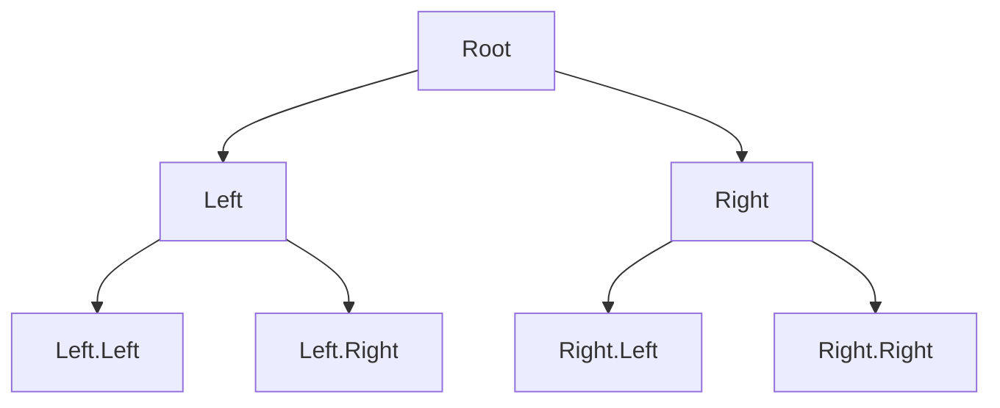

## 9.4. Trees and Functional Data Structures

In functional programming, data structures play a crucial role in organizing and managing data efficiently. Among these structures, trees, particularly binary trees, stand out due to their versatility and efficiency in various applications such as searching, sorting, and representing hierarchical relationships. This section delves into the intricacies of binary trees, exploring their structure, uses, and how they can be navigated and manipulated using functional programming paradigms.

### Binary Trees and Their Uses

A binary tree is a hierarchical data structure in which each node has at most two children, referred to as the left and right child. This simple yet powerful structure is foundational in computer science, underpinning many algorithms and systems.

#### Applications of Binary Trees

1. **Searching and Sorting:**
   - Binary Search Trees (BST) are a type of binary tree that maintains elements in a sorted order, allowing for efficient searching, insertion, and deletion operations.
   
2. **Hierarchical Data Representation:**
   - Trees naturally represent hierarchical data, such as file systems, organizational structures, and decision processes.

3. **Expression Parsing:**
   - Abstract Syntax Trees (AST) are used in compilers to represent the syntax of programming languages.

4. **Networking and Routing:**
   - Trees are used in network routing algorithms to determine the most efficient paths.

### Navigating and Manipulating Trees Functionally

In functional programming, trees are typically manipulated using recursive techniques. This approach aligns with the immutable nature of functional programming, where data structures are not modified in place but rather transformed into new structures.

#### Recursive Tree Traversal

Tree traversal is a fundamental operation that involves visiting each node in a tree in a specific order. Common traversal methods include:

- **In-order Traversal:** Visits the left subtree, the root node, and then the right subtree.
- **Pre-order Traversal:** Visits the root node, the left subtree, and then the right subtree.
- **Post-order Traversal:** Visits the left subtree, the right subtree, and then the root node.

These traversal methods can be implemented recursively, leveraging the natural recursive structure of trees.

#### Example: In-order Traversal in Haskell

```haskell
data Tree a = Empty | Node a (Tree a) (Tree a)

inOrder :: Tree a -> [a]
inOrder Empty = []
inOrder (Node x left right) = inOrder left ++ [x] ++ inOrder right
```

### Visual Aids

To better understand the structure of a binary tree and its traversal paths, consider the following diagram:



This diagram illustrates a simple binary tree with a root node and two levels of children, demonstrating the hierarchical nature of the structure.

### Code Snippets

Let's explore how binary trees can be implemented and manipulated in different functional programming languages.

#### Haskell Binary Tree Example

In Haskell, binary trees can be elegantly defined and manipulated using algebraic data types and pattern matching.

```haskell
data Tree a = Empty | Node a (Tree a) (Tree a)

insert :: (Ord a) => a -> Tree a -> Tree a
insert x Empty = Node x Empty Empty
insert x (Node a left right)
  | x < a     = Node a (insert x left) right
  | otherwise = Node a left (insert x right)
```

In this example, the `insert` function recursively inserts a new element into the correct position in the tree, maintaining the binary search tree property.

#### Scala Binary Tree Example

Scala's case classes and pattern matching provide a concise way to define and work with binary trees.

```scala
sealed trait Tree[+A]
case object Empty extends Tree[Nothing]
case class Node[A](value: A, left: Tree[A], right: Tree[A]) extends Tree[A]

def insert[A : Ordering](x: A, tree: Tree[A]): Tree[A] = tree match {
  case Empty => Node(x, Empty, Empty)
  case Node(a, left, right) =>
    if (x < a) Node(a, insert(x, left), right)
    else Node(a, left, insert(x, right))
}
```

This Scala example mirrors the Haskell implementation, using pattern matching to recursively insert elements.

#### JavaScript (Using Immutable.js)

In JavaScript, libraries like Immutable.js facilitate the creation of immutable data structures, including trees.

```javascript
const { Record, Map } = require('immutable');

const Tree = Record({ value: null, left: null, right: null });

const insert = (x, tree) => {
  if (tree === null) return new Tree({ value: x, left: null, right: null });
  if (x < tree.value) {
    return tree.set('left', insert(x, tree.left));
  } else {
    return tree.set('right', insert(x, tree.right));
  }
};

let tree = null;
tree = insert(3, tree);
tree = insert(1, tree);
tree = insert(4, tree);
```

This JavaScript example demonstrates how to use Immutable.js to maintain immutability while manipulating a binary tree.

### References

- "Functional Programming in Scala" by Paul Chiusano and Rúnar Bjarnason.
- "Programming in Haskell" by Graham Hutton.

These references provide further insights into functional programming and the use of data structures like trees.

### Conclusion

Binary trees are a fundamental data structure in functional programming, offering a robust framework for organizing and manipulating data hierarchically. By leveraging recursive techniques and immutability, functional programming languages provide powerful tools for working with trees efficiently and effectively.

## Quiz Time!



### What is a binary tree?

- [x] A hierarchical data structure with at most two children per node.
- [ ] A linear data structure with nodes connected in a sequence.
- [ ] A data structure where each node has exactly three children.
- [ ] A graph with no cycles.

> **Explanation:** A binary tree is a hierarchical data structure where each node has at most two children, known as the left and right child.

### Which traversal method visits the root node first?

- [x] Pre-order Traversal
- [ ] In-order Traversal
- [ ] Post-order Traversal
- [ ] Level-order Traversal

> **Explanation:** Pre-order traversal visits the root node first, followed by the left subtree and then the right subtree.

### In functional programming, how are trees typically manipulated?

- [x] Using recursive techniques.
- [ ] By directly modifying nodes.
- [ ] Through iterative loops.
- [ ] Using global variables.

> **Explanation:** In functional programming, trees are typically manipulated using recursive techniques, which align with the immutable nature of functional programming.

### What is the purpose of the `insert` function in a binary tree?

- [x] To add a new element while maintaining the tree's properties.
- [ ] To remove an element from the tree.
- [ ] To traverse the tree in order.
- [ ] To balance the tree.

> **Explanation:** The `insert` function adds a new element to the binary tree while maintaining its properties, such as the binary search tree property.

### Which language uses pattern matching to manipulate trees?

- [x] Haskell
- [x] Scala
- [ ] JavaScript
- [ ] Python

> **Explanation:** Both Haskell and Scala use pattern matching to manipulate trees, allowing for concise and expressive code.

### What library is used in JavaScript for immutable data structures?

- [x] Immutable.js
- [ ] Lodash
- [ ] jQuery
- [ ] D3.js

> **Explanation:** Immutable.js is a library used in JavaScript to create and manipulate immutable data structures.

### What is a common use of binary trees in computer science?

- [x] Searching and sorting.
- [ ] Storing sequential data.
- [ ] Managing network connections.
- [ ] Rendering graphics.

> **Explanation:** Binary trees are commonly used for searching and sorting due to their efficient structure for these operations.

### How does functional programming handle data structure manipulation?

- [x] By creating new structures rather than modifying existing ones.
- [ ] By using pointers to change data directly.
- [ ] By employing global state changes.
- [ ] By relying on external libraries for all operations.

> **Explanation:** Functional programming handles data structure manipulation by creating new structures rather than modifying existing ones, maintaining immutability.

### What is the result of an in-order traversal of a binary search tree?

- [x] A sorted sequence of elements.
- [ ] A reverse-sorted sequence of elements.
- [ ] A random sequence of elements.
- [ ] A sequence with duplicates.

> **Explanation:** An in-order traversal of a binary search tree results in a sorted sequence of elements.

### True or False: Binary trees can only be used for numerical data.

- [ ] True
- [x] False

> **Explanation:** False. Binary trees can be used for any type of data, not just numerical, as long as the data can be compared to maintain the tree's properties.


