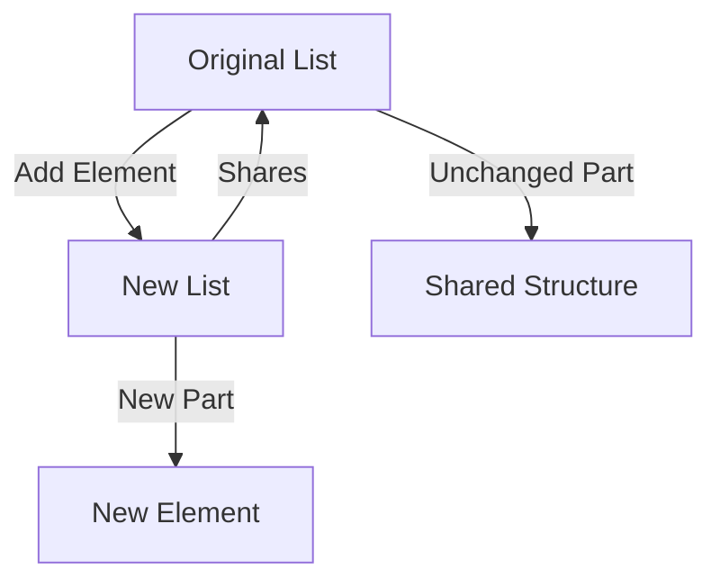

---

linkTitle: "9.5. Working with Immutable Data Structures"
title: "Immutable Data Structures in Functional Programming"
description: "Explore the advantages, best practices, and implementation of immutable data structures in functional programming, with examples in Haskell, JavaScript, and Scala."
categories:
- Functional Programming
- Data Structures
- Software Development
tags:
- Immutable Data Structures
- Functional Programming
- Haskell
- JavaScript
- Scala
date: 2024-10-25
type: docs
nav_weight: 950000
---

## 9.5. Working with Immutable Data Structures

In the realm of functional programming, immutable data structures are a cornerstone that supports the paradigm's emphasis on predictability, safety, and concurrency. By ensuring that data cannot be altered after its creation, immutable structures provide a robust foundation for building reliable and maintainable software. This section delves into the advantages of using immutable data structures, best practices for their implementation, and practical examples in various functional programming languages.

### Advantages in Functional Programming

#### Safer and More Predictable Code

Immutable data structures inherently prevent unintended side effects caused by data mutations. This immutability leads to safer code, as functions that operate on these structures do not alter the original data. Instead, they produce new data structures, leaving the original unchanged. This characteristic is crucial in functional programming, where functions are expected to be pure and free of side effects.

#### Thread Safety and Concurrency

In a multi-threaded environment, mutable data can lead to race conditions and unpredictable behavior. Immutable data structures eliminate these issues by ensuring that data cannot be changed once created. This immutability makes it easier to reason about concurrent programs, as developers do not need to worry about synchronizing access to shared data.

### Best Practices for Using Immutable Structures

#### Selecting Appropriate Data Structures

Choosing the right immutable data structure depends on the specific use case. Lists, sets, and maps are common immutable structures, each with its own strengths. For instance, lists are ideal for ordered collections, while sets are suitable for unique elements. Maps are perfect for key-value associations. Understanding the characteristics of each structure helps in selecting the most efficient one for the task at hand.

#### Leveraging Structural Sharing

Structural sharing is a technique used to optimize performance in immutable data structures. Instead of copying the entire structure when a change is made, only the parts that differ are created anew, while the rest is shared with the original. This approach minimizes memory usage and enhances performance.



#### Avoiding Unnecessary Data Copying

While immutability is beneficial, careless use can lead to performance bottlenecks due to excessive copying. To mitigate this, developers should use libraries and language features that support efficient immutable operations, such as persistent data structures, which inherently use structural sharing.

### Code Snippets

Let's explore how different functional programming languages implement immutable data structures.

#### Haskell Example

Haskell, a purely functional language, naturally supports immutability. Lists in Haskell are immutable by default.

```haskell
let original = [1, 2, 3]
let newList = 0 : original -- [0, 1, 2, 3]
```

In this example, `newList` is created by prepending `0` to `original`, which remains unchanged.

#### JavaScript (Using Immutable.js)

JavaScript, being a multi-paradigm language, requires libraries like Immutable.js to work with immutable data structures.

```javascript
const { List } = require('immutable');

const original = List([1, 2, 3]);
const newList = original.unshift(0); // List [0, 1, 2, 3]
```

Here, `newList` is a new list with `0` added at the beginning, while `original` stays the same.

#### Scala Example

Scala, a language that blends object-oriented and functional programming, provides immutable collections by default.

```scala
val original = List(1, 2, 3)
val newList = 0 :: original // List(0, 1, 2, 3)
```

In Scala, the `::` operator is used to prepend an element to a list, resulting in a new list.

### Conclusion

Immutable data structures are a fundamental aspect of functional programming, offering numerous advantages such as safer code, thread safety, and efficient memory usage through structural sharing. By understanding and applying best practices, developers can leverage these structures to build robust and efficient applications.

### References

- "Elixir in Action" by Saša Jurić.
- "Immutable Data Structures in Clojure" by Rich Hickey.

## Quiz Time!



### What is a primary advantage of using immutable data structures in functional programming?

- [x] They prevent unintended mutations.
- [ ] They allow direct data manipulation.
- [ ] They require less memory.
- [ ] They are faster than mutable structures.

> **Explanation:** Immutable data structures prevent unintended mutations, leading to safer and more predictable code.

### How do immutable data structures enhance thread safety?

- [x] By ensuring data cannot be changed once created.
- [ ] By allowing concurrent modifications.
- [ ] By using locks for data access.
- [ ] By reducing memory usage.

> **Explanation:** Immutable data structures enhance thread safety by ensuring that data cannot be changed once created, eliminating race conditions.

### What is structural sharing in the context of immutable data structures?

- [x] A technique to optimize performance by sharing unchanged parts of data structures.
- [ ] A method to copy entire data structures.
- [ ] A way to lock data structures for thread safety.
- [ ] A process to convert mutable structures to immutable ones.

> **Explanation:** Structural sharing optimizes performance by sharing unchanged parts of data structures, reducing memory usage.

### Which language requires a library to work with immutable data structures?

- [ ] Haskell
- [x] JavaScript
- [ ] Scala
- [ ] F#

> **Explanation:** JavaScript requires libraries like Immutable.js to work with immutable data structures, as it is not inherently functional.

### What is a common pitfall when using immutable data structures?

- [ ] Increased thread safety
- [x] Excessive data copying
- [ ] Reduced code readability
- [ ] Inability to handle large datasets

> **Explanation:** A common pitfall is excessive data copying, which can lead to performance bottlenecks if not managed properly.

### In Haskell, how do you prepend an element to a list?

- [x] Using the `:` operator
- [ ] Using the `+` operator
- [ ] Using the `append` function
- [ ] Using the `concat` function

> **Explanation:** In Haskell, the `:` operator is used to prepend an element to a list.

### What is the result of `0 :: List(1, 2, 3)` in Scala?

- [x] List(0, 1, 2, 3)
- [ ] List(1, 2, 3, 0)
- [ ] List(0, 1, 2)
- [ ] List(1, 2, 3)

> **Explanation:** The `::` operator prepends `0` to the list, resulting in `List(0, 1, 2, 3)`.

### Which of the following is a benefit of using persistent data structures?

- [x] Efficient memory usage through structural sharing
- [ ] Direct data modification
- [ ] Reduced code complexity
- [ ] Faster execution time

> **Explanation:** Persistent data structures use structural sharing to optimize memory usage efficiently.

### What does the `unshift` method do in Immutable.js?

- [x] Adds an element to the beginning of a list
- [ ] Removes an element from the end of a list
- [ ] Adds an element to the end of a list
- [ ] Removes an element from the beginning of a list

> **Explanation:** The `unshift` method adds an element to the beginning of a list in Immutable.js.

### Immutable data structures are inherently thread-safe.

- [x] True
- [ ] False

> **Explanation:** True. Immutable data structures are inherently thread-safe because they cannot be changed once created, eliminating race conditions.


