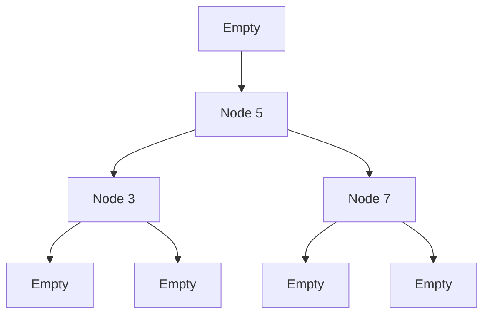

---

linkTitle: "9.6. Practical Exercises"
title: "Functional Data Structures: Practical Exercises"
description: "Explore hands-on exercises to create and manipulate immutable data structures in functional programming, with examples in Haskell and JavaScript."
categories:
- Functional Programming
- Data Structures
- Programming Exercises
tags:
- Functional Programming
- Immutable Data Structures
- Haskell
- JavaScript
- Practical Exercises
date: 2024-10-25
type: docs
nav_weight: 960000
---

## 9.6. Practical Exercises

In this section, we will delve into practical exercises that focus on creating and manipulating functional data structures. These exercises are designed to reinforce your understanding of immutable data structures and how to perform common operations on them in a functional programming context. By the end of this section, you will have hands-on experience with implementing and using functional data structures in languages like Haskell and JavaScript.

### Creating and Manipulating Functional Data Structures

Functional programming emphasizes immutability, which means once a data structure is created, it cannot be changed. Instead, operations on data structures return new versions with the desired modifications. This approach helps maintain predictability and avoids side effects, which are crucial in functional programming.

#### Exercise 1: Immutable Binary Tree in Haskell

In this exercise, you will create an immutable binary tree, insert elements into it, and traverse the tree to retrieve elements in a sorted order.

**Task:**

1. Define a binary tree data structure.
2. Implement functions to insert elements into the tree.
3. Implement a function to traverse the tree in an in-order fashion.

**Haskell Code Example:**

```haskell
-- Define the binary tree data structure
data Tree a = Empty | Node a (Tree a) (Tree a) deriving (Show)

-- Function to insert an element into the tree
insert :: (Ord a) => a -> Tree a -> Tree a
insert x Empty = Node x Empty Empty
insert x (Node a left right)
    | x == a = Node x left right
    | x < a  = Node a (insert x left) right
    | x > a  = Node a left (insert x right)

-- Function to traverse the tree in-order
traverseInOrder :: Tree a -> [a]
traverseInOrder Empty = []
traverseInOrder (Node a left right) = traverseInOrder left ++ [a] ++ traverseInOrder right

-- Example usage
main :: IO ()
main = do
    let tree = insert 5 (insert 3 (insert 7 Empty))
    print (traverseInOrder tree) -- Output: [3,5,7]
```

**Explanation:**

- The `Tree` data type is defined with two constructors: `Empty` and `Node`.
- The `insert` function adds elements to the tree while maintaining the binary search tree property.
- The `traverseInOrder` function collects elements in sorted order by visiting the left subtree, the node itself, and then the right subtree.

### Implementing Common Data Operations Functionally

Functional data structures often require implementing operations like insertion, deletion, and lookup in a way that returns new structures rather than modifying existing ones.

#### Exercise 2: Immutable Map in JavaScript

In this exercise, you will use the Immutable.js library to create a map, add entries, and filter values based on a condition.

**Task:**

1. Create an immutable map.
2. Add entries to the map.
3. Filter the map to retain only values greater than a specified threshold.

**JavaScript Code Example:**

```javascript
// Import Immutable.js library
const { Map } = require('immutable');

// Create an immutable map
let myMap = Map({ a: 1, b: 2 });

// Add an entry to the map
myMap = myMap.set('c', 3);

// Filter the map to retain values greater than 1
const filteredMap = myMap.filter(value => value > 1);

// Output the filtered map as a plain JavaScript object
console.log(filteredMap.toObject()); // Output: { b: 2, c: 3 }
```

**Explanation:**

- The `Map` function from Immutable.js is used to create an immutable map.
- The `set` method adds a new entry to the map, returning a new map with the added entry.
- The `filter` method creates a new map containing only the entries that satisfy the given condition.

### Visual Aids

To better understand the transformations and manipulations of data structures, let's visualize the operations using Mermaid.js diagrams.

#### Binary Tree Insertion and Traversal



**Explanation:**

- The diagram illustrates the structure of the binary tree after inserting the elements 5, 3, and 7.
- The in-order traversal visits nodes in the sequence: 3, 5, 7.

### References

- "Functional Programming in JavaScript" by Luis Atencio.
- "Purely Functional Data Structures" by Chris Okasaki.

These references provide further insights into functional programming concepts and data structures, offering a deeper understanding of the principles and practices involved.

## Quiz Time!



### What is the primary characteristic of functional data structures?

- [x] Immutability
- [ ] Mutability
- [ ] Dynamic typing
- [ ] Object orientation

> **Explanation:** Functional data structures are characterized by immutability, meaning they cannot be changed once created.

### In Haskell, what does the `insert` function do in the context of a binary tree?

- [x] Adds an element while maintaining the binary search tree property
- [ ] Deletes an element from the tree
- [ ] Balances the tree
- [ ] Converts the tree to a list

> **Explanation:** The `insert` function adds an element to the binary tree while maintaining its properties.

### What library is used in JavaScript to create immutable data structures?

- [x] Immutable.js
- [ ] Lodash
- [ ] jQuery
- [ ] React

> **Explanation:** Immutable.js is a library used to create immutable data structures in JavaScript.

### What is the output of the `traverseInOrder` function in the provided Haskell example?

- [x] [3,5,7]
- [ ] [5,3,7]
- [ ] [7,5,3]
- [ ] [3,7,5]

> **Explanation:** The `traverseInOrder` function outputs elements in sorted order: [3,5,7].

### How does the `filter` method in Immutable.js work?

- [x] It creates a new map with entries that satisfy a given condition
- [ ] It modifies the original map
- [ ] It sorts the map
- [ ] It deletes entries from the map

> **Explanation:** The `filter` method creates a new map containing only the entries that satisfy the specified condition.

### What is the advantage of using immutable data structures?

- [x] Predictability and avoidance of side effects
- [ ] Faster performance
- [ ] Easier debugging
- [ ] Reduced memory usage

> **Explanation:** Immutable data structures provide predictability and help avoid side effects, which are crucial in functional programming.

### In the Haskell example, what does the `Node` constructor represent?

- [x] A node in the binary tree with a value and two subtrees
- [ ] An empty tree
- [ ] A leaf node
- [ ] A balanced node

> **Explanation:** The `Node` constructor represents a node in the binary tree with a value and two subtrees.

### What does the `set` method do in Immutable.js?

- [x] Adds or updates an entry in the map
- [ ] Deletes an entry from the map
- [ ] Sorts the map
- [ ] Filters the map

> **Explanation:** The `set` method adds or updates an entry in the map, returning a new map.

### What is the purpose of the `Empty` constructor in the Haskell binary tree example?

- [x] Represents an empty tree or subtree
- [ ] Represents a leaf node
- [ ] Represents a full tree
- [ ] Represents a balanced tree

> **Explanation:** The `Empty` constructor represents an empty tree or subtree in the binary tree structure.

### True or False: In functional programming, data structures are typically mutable.

- [ ] True
- [x] False

> **Explanation:** In functional programming, data structures are typically immutable, meaning they cannot be changed once created.



By completing these exercises, you have gained practical experience in creating and manipulating functional data structures. These skills are essential for writing efficient and predictable functional programs. Continue exploring and practicing to deepen your understanding of functional programming principles.
